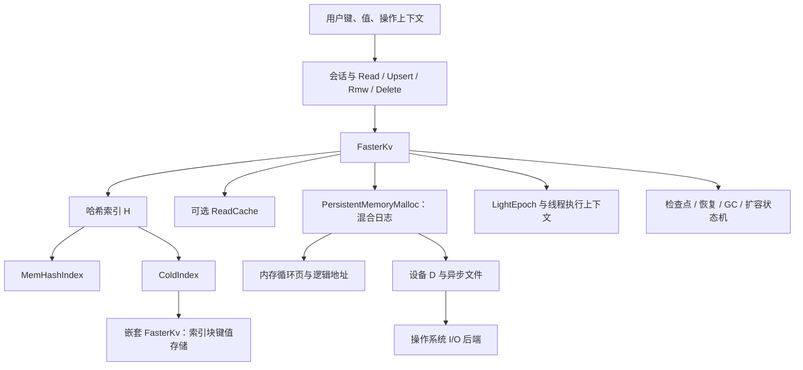
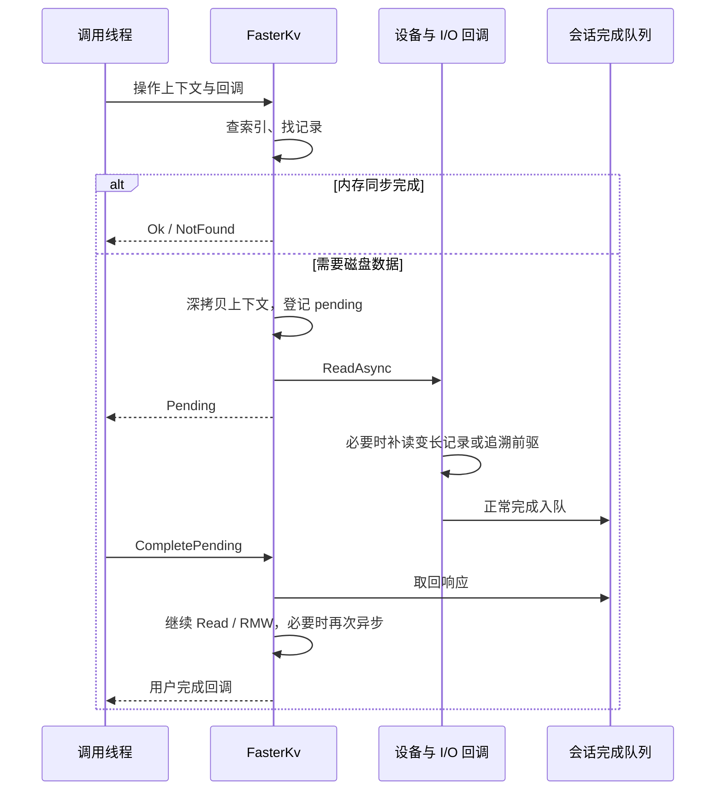
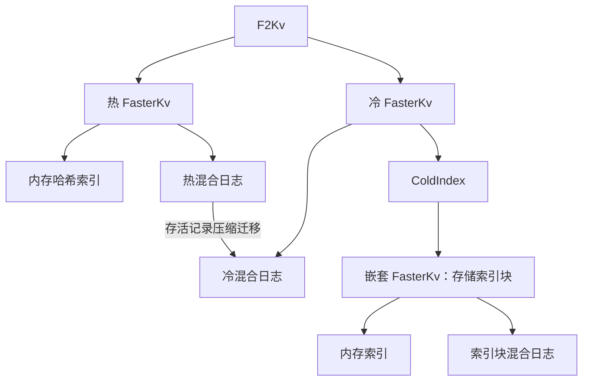

# FASTER C++ 核心抽象与架构调查

本文面向将 `FASTER/cc` 改写为 Rust 的前期理解，基于本地源码静态阅读。原仓库路径为 `FASTER`；以下行号均指本次调查时的文件。未修改原仓库，未执行构建、测试、性能测试或故障注入。架构图是对源码关系的归纳，并非原项目提供的正式规格。

## 1. 架构结论

核心不是“哈希表加文件序列化”，而是**哈希索引定位 + 可原地更新的混合日志 + 会话参与的 epoch 协调 + 异步继续执行 + 版本化检查点**。内存不足时，历史日志驻留磁盘；内存索引保存逻辑地址，检索沿记录链找到实际匹配的键。F2 进一步组合热、冷两个存储，冷索引也通过嵌套的 FasterKv 持久化。

`FasterKv<K, V, D, H = MemHashIndex<D>, OH = H>` 是主要组装点：K/V 为用户数据布局，D 为设备，H 为当前索引，OH 为另一存储的索引类型。构造函数组装设备、混合日志、哈希索引、可选读缓存和可选自动压缩线程。证据：[faster.h:90](https://github.com/microsoft/FASTER/blob/321d872eabda6a0345c8bd76419f89723ed864ae/cc/src/core/faster.h#L90)、[faster.h:131](https://github.com/microsoft/FASTER/blob/321d872eabda6a0345c8bd76419f89723ed864ae/cc/src/core/faster.h#L131)。



其中 `IHashIndex` 并不意味着所有调用都经统一虚函数接口：`FindEntry` 等操作包含模板成员，`FasterKv` 通过模板类型 H 调用。Rust 改写应先提炼行为契约，再决定静态分派和动态分派的范围。

## 2. 核心抽象地图

| 抽象 | 职责与状态 | 关键代码 |
| --- | --- | --- |
| `FasterKv` | 组装存储、执行操作、协调所有生命周期动作 | [faster.h:91](https://github.com/microsoft/FASTER/blob/321d872eabda6a0345c8bd76419f89723ed864ae/cc/src/core/faster.h#L91) |
| `Address` / `AtomicAddress` | 逻辑页号与页内偏移，原子发布地址；区别于进程指针 | [address.h:20](https://github.com/microsoft/FASTER/blob/321d872eabda6a0345c8bd76419f89723ed864ae/cc/src/core/address.h#L20)、[address.h:170](https://github.com/microsoft/FASTER/blob/321d872eabda6a0345c8bd76419f89723ed864ae/cc/src/core/address.h#L170) |
| `RecordInfo` / `Record<K,V>` | 记录头、冲突链、版本、失效/删除状态及变长布局 | [record.h:15](https://github.com/microsoft/FASTER/blob/321d872eabda6a0345c8bd76419f89723ed864ae/cc/src/core/record.h#L15)、[record.h:66](https://github.com/microsoft/FASTER/blob/321d872eabda6a0345c8bd76419f89723ed864ae/cc/src/core/record.h#L66) |
| `MemHashIndex` | 内存桶、查找/创建条目、地址 CAS、检查点、GC、扩容 | [mem_index.h:38](https://github.com/microsoft/FASTER/blob/321d872eabda6a0345c8bd76419f89723ed864ae/cc/src/index/mem_index.h#L38)、[mem_index.h:109](https://github.com/microsoft/FASTER/blob/321d872eabda6a0345c8bd76419f89723ed864ae/cc/src/index/mem_index.h#L109) |
| `PersistentMemoryMalloc` | 页分配、日志窗口推进、刷盘、页复用、恢复装载 | [persistent_memory_malloc.h:233](https://github.com/microsoft/FASTER/blob/321d872eabda6a0345c8bd76419f89723ed864ae/cc/src/core/persistent_memory_malloc.h#L233) |
| `ReadCache` | 缓存读出的记录，通过索引地址标记连接缓存与主日志；负责失效与淘汰 | [read_cache.h:22](https://github.com/microsoft/FASTER/blob/321d872eabda6a0345c8bd76419f89723ed864ae/cc/src/core/read_cache.h#L22)、[read_cache.h:63](https://github.com/microsoft/FASTER/blob/321d872eabda6a0345c8bd76419f89723ed864ae/cc/src/core/read_cache.h#L63) |
| `IAsyncContext` / `CallbackContext` | 同步栈上下文转为异步堆上下文，继续执行期间转移释放责任 | [async.h:27](https://github.com/microsoft/FASTER/blob/321d872eabda6a0345c8bd76419f89723ed864ae/cc/src/core/async.h#L27)、[async.h:107](https://github.com/microsoft/FASTER/blob/321d872eabda6a0345c8bd76419f89723ed864ae/cc/src/core/async.h#L107) |
| `PendingContext` 及操作特化 | 保存操作类型、键哈希、预期索引条目、日志地址、回调和异步索引结果 | [internal_contexts.h:70](https://github.com/microsoft/FASTER/blob/321d872eabda6a0345c8bd76419f89723ed864ae/cc/src/core/internal_contexts.h#L70) |
| `ExecutionContext` / `ThreadContext` | 会话版本、序号、待处理请求、完成队列；当前/前一版本双缓冲 | [internal_contexts.h:814](https://github.com/microsoft/FASTER/blob/321d872eabda6a0345c8bd76419f89723ed864ae/cc/src/core/internal_contexts.h#L814)、[faster.h:59](https://github.com/microsoft/FASTER/blob/321d872eabda6a0345c8bd76419f89723ed864ae/cc/src/core/faster.h#L59) |
| `LightEpoch` | 协作式保护、推进安全 epoch、延迟执行回收/刷盘相关动作 | [light_epoch.h:24](https://github.com/microsoft/FASTER/blob/321d872eabda6a0345c8bd76419f89723ed864ae/cc/src/core/light_epoch.h#L24) |
| `SystemState` / `CheckpointLocks` | 全局动作、阶段、版本以及检查点期间的新旧版本操作协调 | [state_transitions.h:17](https://github.com/microsoft/FASTER/blob/321d872eabda6a0345c8bd76419f89723ed864ae/cc/src/core/state_transitions.h#L17)、[faster.h:1415](https://github.com/microsoft/FASTER/blob/321d872eabda6a0345c8bd76419f89723ed864ae/cc/src/core/faster.h#L1415) |
| `F2Kv` / `ColdIndex` | 热冷路由、跨层压缩、组合检查点；可落盘的冷索引 | [f2.h:42](https://github.com/microsoft/FASTER/blob/321d872eabda6a0345c8bd76419f89723ed864ae/cc/src/core/f2.h#L42)、[cold_index.h:44](https://github.com/microsoft/FASTER/blob/321d872eabda6a0345c8bd76419f89723ed864ae/cc/src/index/cold_index.h#L44) |

## 3. 数据表示与索引

### 3.1 逻辑地址不是内存地址

`Address` 占 8 字节，其中 48 位用于日志地址，页内偏移 25 位，对应 32 MiB 页，页号 23 位。启用读缓存标记时，地址部分最高位用作 `readcache`，相应普通页号位数减少。`kInvalidAddress` 为 1，而空索引条目是全零，二者不能混用。证据：[address.h:15](https://github.com/microsoft/FASTER/blob/321d872eabda6a0345c8bd76419f89723ed864ae/cc/src/core/address.h#L15)、[address.h:133](https://github.com/microsoft/FASTER/blob/321d872eabda6a0345c8bd76419f89723ed864ae/cc/src/core/address.h#L133)。

`RecordInfo` 为 8 字节：前驱地址 48 位、检查点版本 13 位、invalid/tombstone/final 各 1 位。记录布局为“记录头 → 对齐后的键 → 对齐后的值”；键不可变，值可修改，键和值通过 `size()` 描述长度，`disk_size()` 与包含尾部对齐的内存记录大小有所不同。源码使用位域、placement new 和 reinterpret_cast；它没有提供语言无关的稳定序列化格式保证。证据：[record.h:39](https://github.com/microsoft/FASTER/blob/321d872eabda6a0345c8bd76419f89723ed864ae/cc/src/core/record.h#L39)、[record.h:88](https://github.com/microsoft/FASTER/blob/321d872eabda6a0345c8bd76419f89723ed864ae/cc/src/core/record.h#L88)、[record.h:163](https://github.com/microsoft/FASTER/blob/321d872eabda6a0345c8bd76419f89723ed864ae/cc/src/core/record.h#L163)。

### 3.2 哈希桶只缩小搜索范围

热索引桶是一个缓存行：7 个条目加 1 个溢出桶指针；冷索引桶是 8 个条目且没有相同结构的溢出槽。条目保存地址、tag 和 tentative 等状态，不能单凭 tag 认定键相等。实际查找还要沿 `RecordInfo.previous_address()` 追溯并比较键。证据：[hash_bucket.h:167](https://github.com/microsoft/FASTER/blob/321d872eabda6a0345c8bd76419f89723ed864ae/cc/src/index/hash_bucket.h#L167)、[hash_bucket.h:317](https://github.com/microsoft/FASTER/blob/321d872eabda6a0345c8bd76419f89723ed864ae/cc/src/index/hash_bucket.h#L317)、[faster.h:1953](https://github.com/microsoft/FASTER/blob/321d872eabda6a0345c8bd76419f89723ed864ae/cc/src/core/faster.h#L1953)。

新记录准备完成后，`MemHashIndex::TryUpdateEntry` 对预期索引条目做 CAS；失败返回 `Aborted`，调用方将新记录标为 invalid 并重试。因此日志中允许存在未成功发布的记录，扫描和恢复必须理解 invalid。证据：[mem_index.h:368](https://github.com/microsoft/FASTER/blob/321d872eabda6a0345c8bd76419f89723ed864ae/cc/src/index/mem_index.h#L368)、[faster.h:1507](https://github.com/microsoft/FASTER/blob/321d872eabda6a0345c8bd76419f89723ed864ae/cc/src/core/faster.h#L1507)。

## 4. 混合日志与页生命周期

按逻辑地址从旧到新，可将稳定情况下的日志概括为：

```text
已截断区域        磁盘区域        内存只读区域          过渡区域          可变区域
          begin            head              safe_read_only      read_only         tail
```

这是语义示意，不能把图中间距理解成固定大小。head/read-only 的“目标边界”和 safe 边界推进之间可能存在延迟。

- `begin_address`：有效日志最老位置；之前已经被 GC 排除。
- `head_address`：之前的页按磁盘路径处理，内存循环页可进入关闭流程。
- `safe_head_address`：所有受保护线程已经越过的安全边界，约束内存页复用。
- `read_only_address`：新操作不再原地修改其前的记录。
- `safe_read_only_address`：所有线程都看到只读要求后的边界，之前可以按不可变数据读取和刷盘。
- `flushed_until_address`：刷盘进度，不能用 tail 或 read-only 边界替代。
- tail：下次日志分配位置。

证据：[persistent_memory_malloc.h:663](https://github.com/microsoft/FASTER/blob/321d872eabda6a0345c8bd76419f89723ed864ae/cc/src/core/persistent_memory_malloc.h#L663)。

推进只读边界后，源码登记 epoch 回调；旧 epoch 安全后，`OnPagesMarkedReadOnly` 推进 safe 边界并调用 `AsyncFlushPages`。关闭页后，`OnPagesClosed` 结合 flush/close 状态判断何时可清零重开；不是只要页离开逻辑窗口就立即释放。证据：[persistent_memory_malloc.h:779](https://github.com/microsoft/FASTER/blob/321d872eabda6a0345c8bd76419f89723ed864ae/cc/src/core/persistent_memory_malloc.h#L779)、[persistent_memory_malloc.h:803](https://github.com/microsoft/FASTER/blob/321d872eabda6a0345c8bd76419f89723ed864ae/cc/src/core/persistent_memory_malloc.h#L803)、[persistent_memory_malloc.h:831](https://github.com/microsoft/FASTER/blob/321d872eabda6a0345c8bd76419f89723ed864ae/cc/src/core/persistent_memory_malloc.h#L831)。

`PersistentMemoryMalloc` 的名称不能直接理解为要求硬件持久内存。它在这里承担混合日志内存页分配、刷盘和恢复职责，并持有设备日志文件句柄。

## 5. 操作数据流

### 5.1 Read

1. 根据键哈希查询索引；冷索引查询自身可能返回 Pending。
2. 启用读缓存时先尝试缓存，否则获得主日志地址。
3. 地址在内存中时沿记录链找完整键匹配。
4. 可变或过渡区域调用用户上下文的 `GetAtomic`；稳定只读内存区域调用 `Get`。
5. 检查墓碑；普通读取返回 NotFound，内部特定模式可返回 Aborted 供 F2 判断。
6. 地址位于有效磁盘日志区域时发起异步读；低于 begin 则未找到。

证据：[faster.h:1252](https://github.com/microsoft/FASTER/blob/321d872eabda6a0345c8bd76419f89723ed864ae/cc/src/core/faster.h#L1252)、[faster.h:1329](https://github.com/microsoft/FASTER/blob/321d872eabda6a0345c8bd76419f89723ed864ae/cc/src/core/faster.h#L1329)。

### 5.2 Upsert、RMW、Delete

| 操作 | 原地路径 | 追加路径与特殊要求 |
| --- | --- | --- |
| Upsert | 可变区非墓碑记录，用户 `PutAtomic` 成功即完成 | 为新记录分配空间、写键和值、CAS 发布；通常无需先读磁盘旧值 |
| RMW | 可变区调用 `RmwAtomic` | 不存在时 `RmwInitial`，稳定旧值上 `RmwCopy`；旧值在磁盘必须先读取；过渡区延后重试以避免丢更新 |
| Delete | 可变记录标记 tombstone，特定情况下尝试移除索引条目 | 追加墓碑；删除不等于当场物理删除整个历史链 |

证据：[faster.h:1418](https://github.com/microsoft/FASTER/blob/321d872eabda6a0345c8bd76419f89723ed864ae/cc/src/core/faster.h#L1418)、[faster.h:1507](https://github.com/microsoft/FASTER/blob/321d872eabda6a0345c8bd76419f89723ed864ae/cc/src/core/faster.h#L1507)、[faster.h:1678](https://github.com/microsoft/FASTER/blob/321d872eabda6a0345c8bd76419f89723ed864ae/cc/src/core/faster.h#L1678)、[faster.h:1740](https://github.com/microsoft/FASTER/blob/321d872eabda6a0345c8bd76419f89723ed864ae/cc/src/core/faster.h#L1740)、[faster.h:1901](https://github.com/microsoft/FASTER/blob/321d872eabda6a0345c8bd76419f89723ed864ae/cc/src/core/faster.h#L1901)。

检查点阶段还会限制原地路径：通过 checkpoint lock 和版本检查，必要时将旧版本记录更新转为追加新记录。不能将平稳状态下的快速路径规则直接用于全部阶段。

### 5.3 异步不是简单地将函数标记 async



`IAsyncContext::DeepCopy` 第一次将栈对象复制到堆；已经深拷贝的对象不会再次复制。存在父上下文时递归转移。`CallbackContext` 利用 `async` 和 `from_deep_copy()` 决定是否释放，构成明确但复杂的所有权协议。证据：[async.h:35](https://github.com/microsoft/FASTER/blob/321d872eabda6a0345c8bd76419f89723ed864ae/cc/src/core/async.h#L35)、[async.h:78](https://github.com/microsoft/FASTER/blob/321d872eabda6a0345c8bd76419f89723ed864ae/cc/src/core/async.h#L78)、[async.h:114](https://github.com/microsoft/FASTER/blob/321d872eabda6a0345c8bd76419f89723ed864ae/cc/src/core/async.h#L114)。

`CompletePending` 依次驱动设备完成、索引完成、日志完成、Refresh 和重试队列，并在检查点阶段处理前一版本上下文。底层读取可能分多次补齐键头、值头、完整变长记录，发生哈希冲突时继续读前驱记录。证据：[faster.h:948](https://github.com/microsoft/FASTER/blob/321d872eabda6a0345c8bd76419f89723ed864ae/cc/src/core/faster.h#L948)、[faster.h:2213](https://github.com/microsoft/FASTER/blob/321d872eabda6a0345c8bd76419f89723ed864ae/cc/src/core/faster.h#L2213)。

**线程归属边界需要专门验收**：正常磁盘完成先进入发起线程的队列，再由继续执行路径回调用户；但 `AsyncGetFromDiskCallback` 的 IOError 分支直接调用用户回调。不能将“所有回调都在原调用线程”写成未加条件的 API 保证。该异常路径的资源释放、pending 清理和回调次数尚未通过故障注入验证。证据：[internal_contexts.h:869](https://github.com/microsoft/FASTER/blob/321d872eabda6a0345c8bd76419f89723ed864ae/cc/src/core/internal_contexts.h#L869)、[faster.h:2283](https://github.com/microsoft/FASTER/blob/321d872eabda6a0345c8bd76419f89723ed864ae/cc/src/core/faster.h#L2283)。

## 6. 并发、会话与回收

`StartSession` 初始化会话 GUID、版本和序号，并保护 epoch；只能在 REST 阶段启动。`Refresh` 推进本线程观察到的 epoch 并参与特殊阶段，`StopSession` 在有待处理工作时反复驱动完成。会话不是纯统计标识，而是存储正确性与进度协议的一部分。证据：[faster.h:696](https://github.com/microsoft/FASTER/blob/321d872eabda6a0345c8bd76419f89723ed864ae/cc/src/core/faster.h#L696)、[faster.h:733](https://github.com/microsoft/FASTER/blob/321d872eabda6a0345c8bd76419f89723ed864ae/cc/src/core/faster.h#L733)、[faster.h:766](https://github.com/microsoft/FASTER/blob/321d872eabda6a0345c8bd76419f89723ed864ae/cc/src/core/faster.h#L766)。

`LightEpoch` 维护每线程的受保护 epoch、安全可回收 epoch 和延迟动作数组。`BumpCurrentEpoch(callback, context)` 登记动作；`Drain` 根据所有受保护线程的最低进度执行安全动作。故长时间不推进的活跃线程可能延迟刷盘边界、回收和生命周期动作；这是从推进机制得到的工程推断，未做阻塞实验。证据：[light_epoch.h:172](https://github.com/microsoft/FASTER/blob/321d872eabda6a0345c8bd76419f89723ed864ae/cc/src/core/light_epoch.h#L172)、[light_epoch.h:215](https://github.com/microsoft/FASTER/blob/321d872eabda6a0345c8bd76419f89723ed864ae/cc/src/core/light_epoch.h#L215)、[light_epoch.h:238](https://github.com/microsoft/FASTER/blob/321d872eabda6a0345c8bd76419f89723ed864ae/cc/src/core/light_epoch.h#L238)、[light_epoch.h:267](https://github.com/microsoft/FASTER/blob/321d872eabda6a0345c8bd76419f89723ed864ae/cc/src/core/light_epoch.h#L267)。

并发机制各管不同对象：索引 CAS 负责发布记录，用户 Atomic 方法负责值的并发访问，epoch 负责跨线程安全边界，checkpoint lock 负责新旧版本操作关系。任何单一机制都不能代替其他机制。这里未证明整个实现的线性一致性，也不将所有路径笼统标为无锁。

## 7. 检查点与恢复

### 7.1 协作状态机

一个 FasterKv 同时只执行一种顶层动作：完整检查点、索引检查点、混合日志检查点、恢复、GC 或索引扩容。全局 `SystemState` 将 Action、Phase、version 打包，并通过原子状态切换协调。证据：[state_transitions.h:17](https://github.com/microsoft/FASTER/blob/321d872eabda6a0345c8bd76419f89723ed864ae/cc/src/core/state_transitions.h#L17)。

完整检查点路径如下；单独索引/日志检查点使用相应子路径：


证据：[state_transitions.h:57](https://github.com/microsoft/FASTER/blob/321d872eabda6a0345c8bd76419f89723ed864ae/cc/src/core/state_transitions.h#L57)。

会话有当前/上一版本两套执行上下文；阶段推进时交换，旧版本未完成请求继续排空。持久化执行上下文保存 `serial_num/version/guid`，恢复后可根据 GUID 找到继续执行序号。这解释了 API 为何要求调用者传入单调序号。证据：[internal_contexts.h:814](https://github.com/microsoft/FASTER/blob/321d872eabda6a0345c8bd76419f89723ed864ae/cc/src/core/internal_contexts.h#L814)、[faster.h:2557](https://github.com/microsoft/FASTER/blob/321d872eabda6a0345c8bd76419f89723ed864ae/cc/src/core/faster.h#L2557)、[faster.h:3161](https://github.com/microsoft/FASTER/blob/321d872eabda6a0345c8bd76419f89723ed864ae/cc/src/core/faster.h#L3161)。

**实际配置边界**：源码包含 fold-over 和独立 snapshot-file 两套分支，但当前 `fold_over_snapshot` 是 `static constexpr bool ... = true`。因此本版本默认编译路径是 fold-over；不能把另一分支描述成当前运行时可选配置。证据：[faster.h:439](https://github.com/microsoft/FASTER/blob/321d872eabda6a0345c8bd76419f89723ed864ae/cc/src/core/faster.h#L439)、[faster.h:3324](https://github.com/microsoft/FASTER/blob/321d872eabda6a0345c8bd76419f89723ed864ae/cc/src/core/faster.h#L3324)。

### 7.2 恢复流程

`Recover(index_token, hybrid_log_token, version, session_ids)`：争取恢复动作 → 读取索引与日志元数据 → 检查版本一致 → 读取持久化会话上下文 → 恢复索引及溢出桶 → 重放模糊检查点期间相关日志 → 重建内存日志窗口 → 返回可继续的会话 ID。索引和日志元数据版本不一致返回 Corruption。证据：[faster.h:3436](https://github.com/microsoft/FASTER/blob/321d872eabda6a0345c8bd76419f89723ed864ae/cc/src/core/faster.h#L3436)。

重放并非无条件保留磁盘上全部记录：`RecoverFromPage` 跳过空头/invalid 记录；版本不晚于检查点的记录用于更新索引，较新版本标 invalid，并在需要时将索引回退到前驱地址。证据：[faster.h:2773](https://github.com/microsoft/FASTER/blob/321d872eabda6a0345c8bd76419f89723ed864ae/cc/src/core/faster.h#L2773)。

检查点启动成功、普通写入返回 Ok、刷盘完成和持久化回调代表不同阶段。Rust API 需要明确表达这些区别，不能把一个布尔启动结果直接包装成“数据已持久化”。

## 8. 压缩、截断与扩容

`Compact` 包含使用临时小型 FasterKv 去重并搬运存活记录的算法；`CompactWithLookup` 使用查找及条件插入决定记录是否仍应保留，支持多线程及向另一存储移动。条件插入的意义是避免压缩复制覆盖并发产生的新记录。证据：[faster.h:3585](https://github.com/microsoft/FASTER/blob/321d872eabda6a0345c8bd76419f89723ed864ae/cc/src/core/faster.h#L3585)、[faster.h:4018](https://github.com/microsoft/FASTER/blob/321d872eabda6a0345c8bd76419f89723ed864ae/cc/src/core/faster.h#L4018)、[faster.h:4287](https://github.com/microsoft/FASTER/blob/321d872eabda6a0345c8bd76419f89723ed864ae/cc/src/core/faster.h#L4287)。

`ShiftBeginAddress` 单独启动 GC：先推进逻辑 begin，等待待处理 I/O，再进行截断与索引清理。它不等同于“先自动保留所有存活值”；调用方需明确压缩和截断顺序。读路径还包含读与压缩截断竞争后的再搜索逻辑，避免旧地址消失后产生错误 NotFound。证据：[faster.h:3492](https://github.com/microsoft/FASTER/blob/321d872eabda6a0345c8bd76419f89723ed864ae/cc/src/core/faster.h#L3492)、[faster.h:1029](https://github.com/microsoft/FASTER/blob/321d872eabda6a0345c8bd76419f89723ed864ae/cc/src/core/faster.h#L1029)。

索引扩容通过 GROW_PREPARE/GROW_IN_PROGRESS 阶段，并由参与线程复制旧表的分块；它与日志扩容/压缩是不同动作。证据：[phase.h:40](https://github.com/microsoft/FASTER/blob/321d872eabda6a0345c8bd76419f89723ed864ae/cc/src/core/phase.h#L40)、[mem_index.h:695](https://github.com/microsoft/FASTER/blob/321d872eabda6a0345c8bd76419f89723ed864ae/cc/src/index/mem_index.h#L695)。

## 9. F2 与冷索引

F2 构造两个 FasterKv，设置互相指向的 other-store，并启动后台工作线程。Read 先访问热层，未找到再访问冷层；热层墓碑需要阻止旧冷数据复活，因此使用特殊墓碑返回语义。Upsert 直接进入热层；Delete 在热层强制写墓碑；RMW 热层失败时读冷层再继续处理。证据：[f2.h:42](https://github.com/microsoft/FASTER/blob/321d872eabda6a0345c8bd76419f89723ed864ae/cc/src/core/f2.h#L42)、[f2.h:303](https://github.com/microsoft/FASTER/blob/321d872eabda6a0345c8bd76419f89723ed864ae/cc/src/core/f2.h#L303)、[f2.h:409](https://github.com/microsoft/FASTER/blob/321d872eabda6a0345c8bd76419f89723ed864ae/cc/src/core/f2.h#L409)、[f2.h:443](https://github.com/microsoft/FASTER/blob/321d872eabda6a0345c8bd76419f89723ed864ae/cc/src/core/f2.h#L443)、[f2.h:577](https://github.com/microsoft/FASTER/blob/321d872eabda6a0345c8bd76419f89723ed864ae/cc/src/core/f2.h#L577)。

`ColdIndex::store_t` 明确定义为 `FasterKv<HashIndexChunkKey, HashIndexChunkEntry, ...>`。这意味着查一条冷数据可能先异步读取索引块，再异步读取冷日志记录；冷索引不是简单地把普通哈希表整体 mmap。证据：[cold_index.h:62](https://github.com/microsoft/FASTER/blob/321d872eabda6a0345c8bd76419f89723ed864ae/cc/src/index/cold_index.h#L62)、[cold_index.h:325](https://github.com/microsoft/FASTER/blob/321d872eabda6a0345c8bd76419f89723ed864ae/cc/src/index/cold_index.h#L325)。



## 10. 设备边界与移植关注点

`FileSystemDisk` 持有 I/O handler 和分段日志文件；`FileSystemSegmentedFile` 将逻辑偏移映射为段号和段内偏移，再调用 ReadAsync/WriteAsync。`TryComplete` 驱动 handler 完成。Linux 代码有 QueueIoHandler 和 UringIoHandler；平台后端与核心 KV 操作通过设备/文件契约相连。证据：[file_system_disk.h:241](https://github.com/microsoft/FASTER/blob/321d872eabda6a0345c8bd76419f89723ed864ae/cc/src/device/file_system_disk.h#L241)、[file_system_disk.h:284](https://github.com/microsoft/FASTER/blob/321d872eabda6a0345c8bd76419f89723ed864ae/cc/src/device/file_system_disk.h#L284)、[file_system_disk.h:463](https://github.com/microsoft/FASTER/blob/321d872eabda6a0345c8bd76419f89723ed864ae/cc/src/device/file_system_disk.h#L463)、[file_linux.h:164](https://github.com/microsoft/FASTER/blob/321d872eabda6a0345c8bd76419f89723ed864ae/cc/src/environment/file_linux.h#L164)、[file_linux.h:301](https://github.com/microsoft/FASTER/blob/321d872eabda6a0345c8bd76419f89723ed864ae/cc/src/environment/file_linux.h#L301)。

`storage.h` 还有本地/远端组合设备，但其 `StorageFile::Truncate` 明写“当前不做事”的注释。设备具有同名 API 不代表物理回收语义相同；该可选设备的编译和运行适配状态本次未验证。证据：[storage.h:550](https://github.com/microsoft/FASTER/blob/321d872eabda6a0345c8bd76419f89723ed864ae/cc/src/device/storage.h#L550)、[storage.h:711](https://github.com/microsoft/FASTER/blob/321d872eabda6a0345c8bd76419f89723ed864ae/cc/src/device/storage.h#L711)。

以下是由源码提出的 Rust 设计议题，不是已经批准的实现方案：

1. **数据格式**：明确是否需要读取已有 C++ 文件；若需要，必须确定字节序、位域、对齐、变长数据及会话元数据兼容策略。
2. **生命周期**：用类型表示会话与受保护内存访问范围，避免将日志指针或引用带出 epoch；不要机械地把所有 C++ 指针替换为长期引用。
3. **用户并发契约**：明确 `GetAtomic/PutAtomic/RmwAtomic` 的同步责任及失败语义。只保护索引不足以保护用户值。
4. **异步契约**：定义请求所有权、一次完成、取消、错误回调线程、驱动进度与关闭行为；若提供 Future，应与底层会话队列协议连接。
5. **一致性状态机**：单独建模当前/旧版本上下文、检查点锁、恢复筛选、墓碑与压缩竞争，不应先删去这些机制后仍声称语义等价。
6. **范围切分**：基础 FasterKv、可落盘索引、F2、读缓存、远端设备是不同复杂度层次；应按功能/API 清单决定首批范围。

这些议题需要通过契约与针对性测试验证，包括内存/磁盘同键竞争、变长补读、I/O 错误、检查点期间写入、崩溃恢复、压缩与读取竞争、F2 墓碑遮蔽。本文未宣称现有代码或未来 Rust 版本已通过这些验收。
