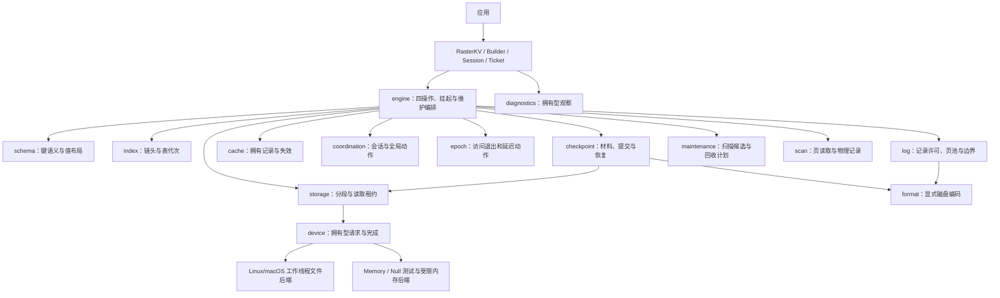

# RasterKV Rust 抽象与模块设计

更新日期：2026-09-12。本文描述当前实现，P0—P8 已验收，P9 总验收尚未完成。范围见 [05](05-RasterKV第一阶段与支持库选型.md)，术语见 [CONTEXT](../CONTEXT.md)，逐模块接入位置见 [13](13-模块基础骨架.md)。初版方案保留在 [固定历史版本](https://github.com/wayslog/raster/blob/52c0657661edc319e5e6bc4af2ab7518d88733f6/docs/09-RasterKV模块设计.md)。

## 1. 公开边界和所有权

采用共享 `RasterKV<S>`、线程绑定 `Session<S>`、拥有型操作和类型化 `Ticket<T>`。`RasterKV` 的 Clone 共享同一 Engine；会话保存原线程的操作与结果，多个异构票据不借用 Session。设备线程只处理文件与字节，业务操作回调由原会话线程执行。核心不要求外部运行时。

Schema 决定键语义和值表示，DeviceFactory/Device 提供拥有型 I/O。索引、混合日志、epoch、协调器、检查点分别封装自己的状态；公开 API 不暴露桶指针、日志页指针或可修改全局阶段。

[lib.rs](../src/lib.rs) 实际公开 api、types、config、schema、device、diagnostics 六个模块，并重导出 Builder、RasterKV、Session、Submission、Ticket。其余十二个模块属于内部实现，不能从模块设计图推导它们是可替换的公开 trait。默认索引为 MemIndex；第三方索引注入不在现有公开签名中。

## 2. 组件关系

图表示职责协作，不是精确 Rust import 图。运行期编排主要位于 engine：它把日志产生的稳定字节交给 storage/device，再将完成结果推进到原任务。设备不反向持有 Engine 或用户上下文。扫描与维护也有 engine 侧的运行任务，不能只读同名小模块就认为流程完整。

## 3. 18 个模块的职责

| 模块 | 封装的状态与复杂性 | 对调用方提供的边界 |
| --- | --- | --- |
| api | 创建、线程会话、操作提交、票据、维护报告、扫描 | 应用只观察公开结果与错误 |
| types | 身份、逻辑地址、版本、错误影响、预算和截止时间 | 不混用会话序号、地址和持久化版本 |
| config | 九组配置、完整 TOML 映射、尺寸与资源校验 | 准备错误在设备打开或请求接受前拒绝 |
| schema | 规范键编码、稳定哈希、拥有值与活跃表示 | 安全业务视图与 unsafe 专家布局分离 |
| engine | 接受、版本许可、执行、挂起、完成路由、维护编排 | 每个已接受操作一次终结，保存实际失败影响 |
| index | tag、桶/溢出链、修订和表代次、条件发布、扩容 | 返回可重查快照，隐藏桶引用和旧表寿命 |
| log | 对齐页、记录初始化、MutationGate、查链、刷盘和淘汰 | 提供带有效范围及代次的短期许可 |
| cache | 有界缓存记录、最近窗口、失效与淘汰 | 命中仍核对当前索引和主日志来源 |
| epoch | 参与者、嵌套 guard、延迟动作 | 访问退出后才执行回收；不承担检查点切分 |
| coordination | 活跃身份、接受序号、版本、参与集合和动作互斥 | 固定会话切分，拒绝冲突动作 |
| checkpoint | 索引/日志材料、manifest/commit、目录锁、恢复重放及保留图 | 完整提交可恢复；材料与运行工作段分离 |
| maintenance | 压缩扫描候选、去重预算及回收规划 | 运行任务和自动调度由 engine 编排 |
| scan | 物理记录解析、页范围和读取状态 | 拥有型扫描记录；无去重快照承诺 |
| storage | 段映射、文件代次、跨段传输和租约 | 逻辑地址转为受保护文件访问 |
| device | 有界接受、线程池、文件/目录操作和缓冲归还 | 完成投递不执行用户代码；能力声明真实 |
| format | v1 明确字节布局、长度/身份/校验验证 | 不落盘 Rust 内存镜像或缓存地址 |
| sync | 标准库锁、原子量及发布顺序约定 | 统一原语入口；未接入 Loom 替代实现 |
| diagnostics | 状态快照及统计类型 | 观察来自真实组件，非全局事务快照 |

当前实现含 Mutex 保护的完成邮箱、版本登记、协调表和业务条带仲裁，不具备整体无锁性质。索引条件发布、原子值和 epoch 的存在也不代表请求路径没有锁。性能限制与后续竞争优化见 [性能复核](acceptance/P9.2性能复核结论.md)。

## 4. 关键执行路径

### 接受与同步操作

Session 先验证线程/身份状态、严格递增序号及资源预算；非法序号在调用用户键逻辑前拒绝。准备失败返回 `Rejected<R>` 并归还原操作；成功接受才更新序号。计算回调与原地修改按不同失败影响处理。

查找经过索引快照和完整键比较；tag 相同不足以证明键相等。Read 可以访问驻留记录、有效缓存或磁盘链。Upsert/RMW 在记录可变且版本许可允许时尝试原地更新，否则准备新记录并条件发布；Delete 遮蔽旧值。布局/用户错误不能伪装为内部许可争用。

### 挂起与继续

等待 I/O、日志容量或版本许可时，原操作进入 SessionRuntime 的当前/前一 ExecutionContext。业务回调和非 Send 输出留在原线程；设备只拥有缓冲。CompletionHub 校验身份后保存完成到原邮箱，任意线程轮询设备都不能代替原会话执行用户回调。

继续执行时重取记录许可并重查索引、版本与截断边界。用户回调或修改已经生效后，不因结果通知失败而重放。票据超时与放弃不取消请求；未收取结果受 max_results 限制。同步 Upsert 直接移交结果，真正挂起时才建立共享票据槽。

### 检查点与恢复

维护启动先取得全局动作许可，版本切分固定参与者与旧请求。新版本不能原地改写旧版本记录；同键旧请求仍在途时，新版本等待。Index 保存索引材料但不宣布会话持久化；Full/Log 成功报告才携带持久化进度。

材料写入、文件同步、manifest 和最终 commit 发布依次验证。恢复校验存储身份、Schema、索引/日志配对及材料完整性，重放后在独立工作目录准备全部组件，成功才返回实例。原会话身份经 continue_session 显式激活。

### 在线维护

扩容逐桶迁移并保留旧表；Pending 从当前代次重定位。读缓存安装和命中都校验来源，持久索引规范化为日志地址。扫描在短期稳定许可内复制值，返回拥有数据。

压缩用完整键确认当前源，受记录替换许可保护地编码、初始化并条件发布。单/多工作者复用相同复制内核；选项决定后续检查点和逻辑截断。GC 将逻辑边界与物理删除分开，运行租约导致本次动作报告延后，检查点材料按保留图显式释放。

## 5. 演进与验证边界

低层改动应先定位封装其不变量的模块，同时沿 engine 的真实入口验证调用链。不能只修改结构定义、用测试模型替代生产路径或用通过编译代表后端可用。具体路径、测试与阶段记录见 [13](13-模块基础骨架.md)。

第一期实际磁盘格式为 v1，Rust/MSRV 为 1.98.1。Linux/macOS 各有默认、config-toml、全部特性检查；全部特性通过仍不表示 io_uring 已实现。F2、ColdIndex、跨 store 压缩、Windows、io_uring、远端设备与 async 外观属于后续范围。

P9.1 原始随机删除返回差异尚待最终选择，P9.2 保留明确性能限制，P9.3 文档整理不能提前将整个第一期标为完成。
