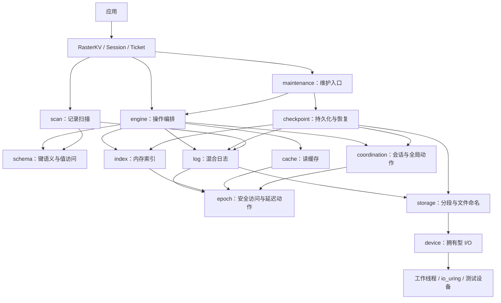

# RasterKV Rust 抽象与模块设计

日期：2026-09-10。状态：**建议设计，尚未实施**。已确定的名称、范围和独立文件格式见 [05](05-RasterKV第一阶段与支持库选型.md)；领域词汇见 [CONTEXT](../CONTEXT.md)。本文选择推荐方案，不把它标为用户已逐项批准的最终接口。

后续进展：已按本文创建模块代码骨架，具体接口与实现边界以 [13](13-模块基础骨架.md) 为准。下文“尚未创建”描述的是本设计形成时的状态，存储算法仍未实现。

## 1. 推荐结构

P1.1 已落实类型与键模块：身份生成、地址算术、ByteKey/U64Key、固定哈希及语义匹配检查。具体约定见 [类型与键契约](acceptance/P1.1类型与键契约.md)；日志、索引与恢复入口仍由后续阶段接入。

采用 **共享 RasterKV + 线程绑定 Session + 拥有型操作 + 类型化票据**。业务操作在调用线程尝试完成，挂起时保存拥有型继续执行状态。设备线程只搬运拥有的字节缓冲，用户上下文始终由会话线程执行。核心不要求外部 async runtime。

Schema 决定键语义和数值表示；设备接口屏蔽工作线程、io_uring 等差异；索引、混合日志、epoch、检查点各自封装协议。公开接口不暴露桶指针、日志页指针或全局阶段字段。

这是三种接口设计对照后的综合选择：采用类型化会话方案的易用性，保留操作上下文方案的扩展能力，将 Future/actor 方案后置。完整比较及调用例见 [12](12-接口方案比较.md)。



图表示职责和主要调用关系；Rust 文件间 import 的限制见第 4 节。异步回送通过事件和请求标识完成，不通过反向持有整个 Engine 实现。

## 2. 一个 crate 开始，内部模块清晰

先用一个库 crate，避免尚无独立发布需求就拆出多个互相绑定的 crate。未来 package 名需另核查，本文示例使用库导入名 `raster`、类型名 `RasterKV`。以下是拟建目录，**本轮不创建 src 或 Cargo 文件**。

```text
raster/
├── CONTEXT.md                 领域术语
├── docs/                      调查与设计
├── src/
│   ├── lib.rs                 只重导出公开接口
│   ├── api/
│   │   ├── store.rs           RasterKV、Builder、恢复入口
│   │   ├── session.rs         Session、关闭与推进
│   │   ├── operation.rs       四种操作协议与内建操作
│   │   ├── completion.rs      Submission、Ticket、Outcome
│   │   ├── maintenance.rs     维护句柄、报告与等待
│   │   └── scan.rs            扫描接口和拥有型记录
│   ├── types/                 ID、地址、版本、状态、错误
│   ├── config/                配置校验、可选 TOML
│   ├── schema/
│   │   ├── key.rs             KeyCodec 与稳定哈希契约
│   │   ├── value.rs           ValueLayout 与短期访问能力
│   │   └── builtin.rs         字节键、整数键、通用值、原子值
│   ├── engine/
│   │   ├── read.rs            查索引、追链、缓存和补读
│   │   ├── upsert.rs          原地修改或追加发布
│   │   ├── rmw.rs             初始化、原地、复制更新与重试
│   │   ├── delete.rs          墓碑与索引更新
│   │   ├── pending.rs         异构拥有型继续执行状态
│   │   └── progress.rs        完成事件、重试与阶段推进
│   ├── index/                 桶项、溢出桶、扩容、索引快照
│   ├── log/                   分配、页状态、边界、记录访问
│   ├── cache/                 缓存记录、失效、淘汰
│   ├── epoch/                 参与者、保护和延迟动作
│   ├── coordination/          会话注册、版本切换、全局动作仲裁
│   ├── checkpoint/            快照材料、manifest 发布、恢复
│   ├── maintenance/           压缩、GC、扩容及自动调度编排
│   ├── scan/                  页面缓冲、物理记录扫描
│   ├── storage/               分段文件、命名空间、元数据存储
│   ├── device/
│   │   ├── mod.rs             Device / DeviceFactory 契约
│   │   ├── buffer.rs          AlignedBuffer 与所有权
│   │   ├── thread_pool.rs     基础文件后端
│   │   ├── uring.rs           Linux 可选后端
│   │   └── memory.rs          可控内存设备
│   ├── format/                显式磁盘编码与格式验证
│   ├── sync/                  原子/锁适配及 Loom 模型入口
│   └── diagnostics/           指标快照与可选事件
├── tests/                     用户接口验收、设备契约和恢复测试
├── benches/                   微基准与端到端工作负载
└── examples/                  基础操作、变长值、恢复、并发和工具
```

叶文件按实现规模逐步创建，目录树是职责归属，不要求立刻建空文件。`api` 是公开类型适配层；实际协议分别集中在对应内部模块，避免所有逻辑重新堆进一个巨型文件。

## 3. 核心 Module 的 Interface

Module 表示带接口和实现的模块；Interface 包含类型、约束、完成条件和错误；Seam 表示可更换实现的位置；Adapter 是在该位置满足接口的具体实现。

| Module | 对调用者的 Interface | 隐藏的 Implementation | 主要不变量 |
| --- | --- | --- | --- |
| RasterKV | 创建/恢复、开始会话、维护、扫描、诊断、显式 shutdown | 共享引擎与资源组织 | 恢复期间无业务会话；关闭与新会话竞争受控 |
| Session | 四种操作、poll、wait、close | 当前/旧版本状态、类型擦除的挂起任务 | 同会话序号有序，结果一次交付，线程固定 |
| Schema | KeyCodec 与 ValueLayout | 编码、相等性、值访问策略 | 等价键同 hash；值访问不产生别名或数据竞争 |
| Index | locate、compare_publish、grow、snapshot/restore | tag、桶、溢出链、表代次 | 发布只指向已初始化记录；旧表回收受保护 |
| HybridLog | reserve、publish/abandon、lease、advance、flush | 循环页、地址映射、页状态 | 页复用晚于访问结束与刷盘/关闭完成 |
| ReadCache | lookup、insert_if_current、invalidate、evict | 缓存链与主日志地址关系 | 不能覆盖新值或复活墓碑；持久化不依赖缓存 |
| Epoch | register、enter、advance、defer | 参与者槽与安全回收 epoch | 旧读者结束前，不执行破坏其可见内存的动作 |
| Coordination | enroll、observe/ack、start_action、fail_action | 会话版本与系统阶段 | 检查点、恢复、GC、扩容的全局动作仲裁一致 |
| Checkpoint | start、step、report、recover | 状态材料、校验、文件同步和提交标识 | 成功报告只能指向可恢复、已发布的检查点 |
| Maintenance | compact、shift_begin、grow、auto_tick | 条件复制、调度、联合步骤 | 压缩复制不覆盖新值；删除旧段先满足安全条件 |
| Storage | log segment、checkpoint object、sync/publish/remove | 文件命名与段映射 | 同一存储身份、段代次、恢复集来源必须一致 |
| Device | submit、poll、sync/namespace operations、shutdown | OS I/O、线程、句柄和完成队列 | 已接受的请求最终归还缓冲；短 I/O 如实返回 |
| Scan | range、next_record、close | 页缓冲与租约 | 返回记录不等于当前最新键，截断竞争可解释 |

`Index` 首期是内部具体模块，其 interface 对测试开放；不为了 F2 预先冻结公共异步索引 trait。扩容旧表/新表及未来 ColdIndex 都通过这个集中位置演进。设备有真实的文件、内存、故障 Adapter；值策略有真实的通用值、原子值 Adapter，值得现在建立 Seam。

## 4. 依赖与可见性规则

1. `types`、`format`、`sync` 位于下层，不依赖 Engine；`format` 接收字段和值字节，不理解活跃会话或操作回调。
2. `epoch` 不知道检查点名称；`coordination` 可以使用 epoch，并负责把“安全回收 epoch”与“检查点版本”分开。
3. `index` 不读取磁盘 Value，不调用用户操作，不持有 RasterKV；它返回带表代次的逻辑快照，追链由 engine 完成。
4. `log` 不调用 Read/RMW 回调；它只发放记录访问能力和执行日志动作。页状态变更通过事件回报上层。
5. `device` 不认识 Schema、会话序号和检查点阶段；设备请求只有文件身份、偏移、缓冲和路由标识。
6. `maintenance` 可复用 engine 的内部条件复制原语；engine 不反向调用整个 maintenance。空间不足时返回推进信号，由顶层 progress/维护调度器处理。
7. 全局动作由 coordination 仲裁；checkpoint/maintenance 执行状态步骤并提交结果，不互相调用阻塞等待函数。
8. 用户通常只导入 `api` 重导出与安全 schema Adapter。底层 unsafe ValueLayout 和设备扩展放在明确的扩展命名空间；私有字段不因测试而改成公开。

## 5. 泛型和动态分派

对外只采用 `RasterKV<S: Schema>` 与 `Session<S>`，避免把设备、索引、另一存储索引等模板参数传播到每个操作。Schema 和四类操作静态分派，保留内存快速路径。

DeviceFactory 以共享、可发送的配置创建后端；实际 driver 可固定在专属线程。I/O 块请求在设备 Seam 使用动态分派或内部枚举，两者不向用户泛型泄漏。每块 I/O 的分派成本应测量，但不将其放进每次 key 比较。

同步完成不要求为操作建立票据或 Box。进入 Pending 后才创建任务槽和输出槽；用户请求仍有具体类型，擦除仅用于会话内部异构调度。自定义读取输出可以是不同类型，也可以不是 Send。

## 6. 所有权总览

| 对象 | 拥有者与线程 | 生命周期 |
| --- | --- | --- |
| EngineInner | RasterKV、Session 及后台工作的共享引用 | 所有使用者与在途资源释放后才能销毁 |
| 用户操作上下文 | 调用栈 → 当前 Session 的挂起表 | 在原会话线程完成或放弃；不发给 I/O 线程 |
| Ticket 输出槽 | 本线程 Ticket 与对应任务 | 接受一次结果、最多收取一次；丢 Ticket 不回滚写 |
| 日志页 | HybridLog 的页池与受控租约 | 访问保护、flush 和设备引用共同决定能否复用 |
| I/O 缓冲 | 请求提交前属于调用者，接受后属于 Device | 收到终结事件后归还；超时不提前释放 |
| 记录视图 | 一次同步调用的 guard | 不跨 Pending，不进入用户拥有输出 |
| 维护句柄 | 只观察共享任务状态 | 不持有业务会话借用；等待需要明确推进者 |

详细的类型草案见 [10](10-RasterKV公开接口.md)，内存/I/O/恢复协议见 [11](11-RasterKV内存与状态协议.md)。

## 7. 功能归属与设计验收

| 上游功能 | RasterKV 归属 | 验收入口 |
| --- | --- | --- |
| Read/Upsert/Rmw/Delete 与变长上下文 | Session + operation + schema + engine | 同步/挂起同结果、原地/追加回退、碰撞与删除 |
| Start/Continue/Stop/Refresh/CompletePending | Session + coordination + progress | 线程限制、序号、重复取票、错误与退出排空 |
| 检查点三种模式与恢复 | Maintenance + checkpoint + format | 成功 token/恢复集、会话进度、崩溃与错误恢复 |
| Compact/CompactWithLookup/自动压缩 | maintenance + 内部条件复制 | 活值保留、重插入、并发读写、压缩后检查点 |
| ShiftBeginAddress/GC | maintenance + storage + epoch | 逻辑推进、在途读取、物理段删除与索引清理 |
| GrowIndex | index + coordination | 旧表可读、新表发布、回收及冲突链保留 |
| ReadCache | cache + engine | 失效、淘汰、墓碑、检查点过滤缓存地址 |
| 记录扫描及缓冲模式 | scan + log + storage | 范围、旧版本/墓碑、变长、截断竞争 |
| 配置、统计、分布和 Size | config + diagnostics | 参数拒绝、结构化指标；Size 映射为 log_span_bytes |
| Null/本地设备、平台后端 | device + storage | 相同设备契约测试，各平台实际验证 |

F2、ColdIndex、跨 store 压缩、云设备与 Future 门面仍是 [05](05-RasterKV第一阶段与支持库选型.md) 中的后续事项。第一阶段的读缓存、压缩、扩容及恢复不因模块化而减配。

下一步适合先写接口骨架及编译期约束测试，再分别实现内存快速路径、设备协议和阶段状态机。本轮只形成设计文档，未证明性能或正确性。

P7.1 实施分工：`engine/compaction.rs` 持有动作、候选集合、一次完成端和失败影响统计；`maintenance/scan.rs` 提供不等待设备的单页物理扫描；`engine/conditional_copy.rs` 负责完整键重查和源许可覆盖的同步发布。任务状态不持有 Engine Arc 或 Schema 拥有值；范围和复制判断使用真实日志、索引与 I/O 完成。
