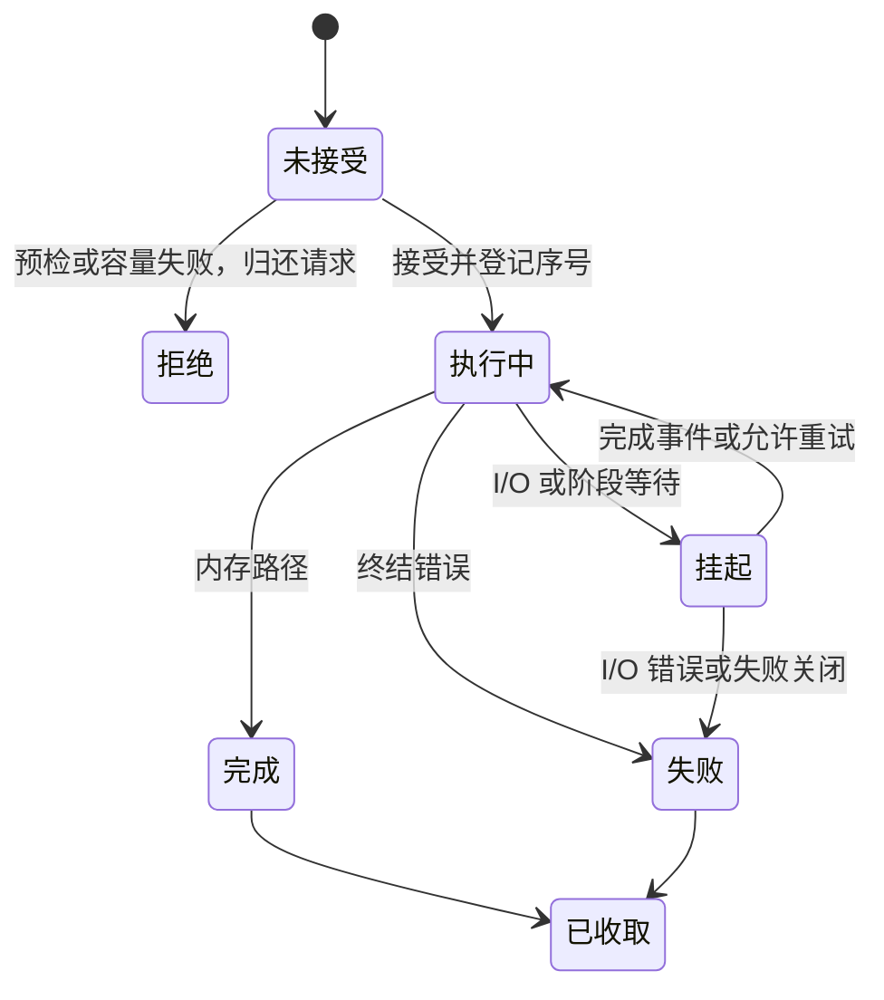

# RasterKV 内存、I/O 与状态协议

日期：2026-09-10。状态：建议设计，未实现或证明。本文是 [公开接口](10-RasterKV公开接口.md) 的正确性契约；无法仅靠给 C++ 类型换名字完成这些职责。

## 1. Schema 把键语义与值表示分开

P1.1 已实现键规范编码与固定版本哈希，见 [类型与键契约](acceptance/P1.1类型与键契约.md)。身份拒绝全零；地址零有效，u64::MAX 无效。编码版本、算法、种子变化均须拒绝，后续恢复入口必须调用 validate_identity；地址 validate 不授予记录访问许可。值访问、并发和恢复协议尚未实现。

```rust
pub trait Schema: Send + Sync + 'static {
    type Key: KeyCodec;
    type Value: ValueLayout;

    fn key_codec(&self) -> &Self::Key;
    fn value_layout(&self) -> &Self::Value;
}

pub trait KeyCodec: Send + Sync + 'static {
    type Key: ?Sized;
    type OwnedKey: std::borrow::Borrow<Self::Key> + 'static;

    fn format_id(&self) -> FormatId;
    fn hash(&self, key: &Self::Key) -> KeyHash;
    fn encoded_len(&self, key: &Self::Key) -> Result<u32, CodecError>;
    fn encode(&self, key: &Self::Key, out: &mut [u8]) -> Result<(), CodecError>;
    fn equals_encoded(&self, key: &Self::Key, encoded: &[u8]) -> Result<bool, CodecError>;
    fn decode_owned(&self, encoded: &[u8]) -> Result<Self::OwnedKey, CodecError>;
}
```

这是关键接口的形状，辅助类型略去。`ByteKey` 和 `U64Key` 是两个实际 Adapter；请求拥有键，key() 只临时借用。`equals_encoded` 支持浅查询键与深存储键匹配，不要求先反序列化整个存储键。

KeyCodec 必须保证等价键相同 hash，编码在同一格式版本下稳定，长度与实际写入相符。安全实现错误最多导致 CodecError/业务错误；引擎必须自己验证范围，不能因为用户返回一个长度就越界写。后台压缩优先复制已验证的键字节，不要求会话的非 Send 查询上下文跨线程。

`ValueLayout` 表示“值在活跃日志中怎样访问、如何转换为磁盘表示”，不是单纯的 Serde trait。它的布局标识、容量规划和磁盘转换属于 Schema；每次操作的输入/投影/RMW 计算属于 Operation。二者不能互相持有对方的会话状态。

## 2. 两条安全值访问路径

| Adapter | 活跃记录表示与访问 | 原地更新与追加 | 适用场景 |
| --- | --- | --- | --- |
| `SerializedValue<C>` | 固定容量字节槽 + 非持久化的记录级同步元数据；读写借用由 guard 控制，用户看解码视图/拥有值 | 在独占许可下验证新编码尺寸、活跃尺寸和对齐后写回原槽；任一不满足或版本不允许时返回 Append | 通用结构体、字符串、变长字节 |
| `AtomicU64Value` 等专用原子 Adapter | 对齐、已初始化的原子单元；访问能力只暴露规定的原子操作或快照 | 成功原子更新保留地址；不支持的大小/模式回退 | 计数器、定长原子更新 |

`SerializedValue<C>` 保留“同一日志地址原地更新”能力，但不声称拥有与原 C++ 用户自定义无锁原子方法相同的性能。需要专门布局时允许专家扩展 ValueLayout；不能以只支持这两个内建类型为由声称任意用户布局已覆盖。

普通数据不能通过多个共享记录指针构造并发 `&mut V`。`UnsafeCell` 不消除数据竞争，也不允许重叠可变引用；原子 Adapter 不能在仍有原子访问时进行普通字节读取。官方约束见 [UnsafeCell](https://doc.rust-lang.org/std/cell/struct.UnsafeCell.html)。

`ValueRead<'g, S>` 与 `ValueUpdate<'g, S>` 包含布局专属的短期能力。生命周期绑定日志页/记录访问 guard，不能构造 `'static` 视图，也不能被操作 Output 带走。需要按布局返回不同借用类型时使用 GAT；GAT 只表达生命周期，并不证明并发正确性。[Rust 关联类型](https://doc.rust-lang.org/reference/items/associated-items.html#associated-types)

通用更新建议先在私有临时值上计算并编码成功，再在独占许可下提交；复杂 RMW 必须对旧值变化进行校验/重试，或在该记录独占期间计算。原子更新的 Updated 必须表示已经完成一次生效变更。返回 Append/Error 必须未修改共享旧值；若专家实现允许部分修改后 panic/error，引擎进入失败状态，不能自动重跑。

提交前必须用新值重新检查磁盘尺寸、活跃尺寸、容量及对齐，不能只检查编码后的字节数。任何一项不满足就放弃原地路径，共享旧值不变；专家布局也遵守这条规则。

### 原地修改与追加替换的共同仲裁

索引 CAS 无法观察“地址不变、值已被另一线程原地修改”。首版采用记录级 `MutationGate`：原子原地写持有共享更新许可，通用值写额外使用其数据独占锁；对仍可修改的源记录执行复制替换时，取得独占替换许可，阻止新写并等待已有写结束。它与 epoch 各自负责写入仲裁和内存存活，不能互相替代。

RMW 的复制路径在独占替换许可内重新确认该记录仍是当前键的最新记录，读取、计算并发布；成功后源记录停止接受新的原地写，失败则废弃候选并重试。Upsert/Delete 的替换也参加同一协议。原地写在取得许可后必须重新确认记录未被替换且版本/可变区条件满足；不能修改已退出当前键版本链头部的旧记录。其他键导致哈希链头变化时，索引 CAS 失败仍须正确重查。

从原地路径的 Append 转向复制路径时，先释放共享许可再申请独占许可，禁止带锁升级。不得跨 Pending、设备等待或需要其他参与者推进的日志分配等待持有这些许可；空间不足则释放许可、记录重试状态，下一轮重新读取旧值。这个保守设计允许原子值并发原地写，但增加仲裁成本；优化为更弱的版本协议前必须有完整模型和实测。

### ValueLayout 专家扩展契约

建议 `ValueLayout` 放在扩展命名空间，以 **unsafe trait** 明示其低层实现责任；常规用户只实现安全 Codec/Operation。先冻结语义，再用接口编译测试确定下面能力的最终 Rust 参数形状，不在未验证前公开裸指针 ABI。

| 必需能力 | 输入/输出与约束 |
| --- | --- |
| `plan` | 输入拥有值，返回活跃尺寸、磁盘编码尺寸、容量和对齐；所有计算检查溢出 |
| `initialize` | 独占未发布区域与初值 → 已初始化记录；失败必须可清理，不暴露半初始化值 |
| `read` | 有效 ReadPermit → 生命周期受限的共享/稳定读取视图 |
| `update` | 有效 UpdatePermit → 布局专属更新能力；不把只有 epoch 保护的共享记录误当独占 |
| `encode_stable` | 已排除并发更新的值 → 完整磁盘字节；不可读取未初始化 padding |
| `decode_initialize` | 已校验磁盘字节 → 同地址槽可容纳的活跃表示；不能恢复进程指针或锁状态 |
| `drop_value` | 最后访问结束后且只执行一次的销毁；磁盘字节不是可直接调用析构的活对象 |

Permit 由引擎密封构造，携带页代次、范围和访问模式。Schema 是 Send + Sync；跨后台任务使用的持久值表示及回收信息也须可安全跨线程。Operation/Output 可以 !Send，因为它们始终属于原 Session。自定义布局必须同时证明读缓存、压缩、恢复和销毁路径，不能只验证正常读取。

## 3. 日志地址、记录与页

```text
LogAddress       单调逻辑地址，不能直接解引用
CacheAddress     独立缓存地址类型，不能写入持久索引
IndexHead        日志头 / 缓存头 / 空项的内部表示
PageId           逻辑页身份
PageGeneration   内存循环页复用代次
RecordLease      短期记录访问保护，不跨 Pending
RecordReservation 未发布记录的独占初始化权
```

不为未来容量需求提前冻结 48 位地址编码；保留原来“逻辑地址、标记、tag”的区分。内存桶项是否继续 64 位打包需在索引设计中确定，并使非法编码无法安全解引用。持久头采用显式编码，不依赖 Rust enum/struct 的默认内存布局。

`HybridLog::reserve` 返回 Reservation；写好 key/value/header 后 `Index::compare_publish` 发布逻辑地址。失败将候选标 invalid 或作为不可见预留空间清理；不能立即复用仍可能被其他线程观测的物理字节。索引查找得到的是地址与表代次快照，不是跨异步保存的桶引用。

日志区间允许目标边界先于安全边界推进：begin 表示有效日志起点，head 表示磁盘读取分界，read_only 表示停止新的原地修改的位置；safe_head/safe_read_only 由参与访问完成后推进。flush 进度单独记录。各边界的约束写成可检查不变量，不把它们合并成一个“已写入位置”。

页状态建议按事实分解：是否禁止写入、是否有读/设备引用、是否 flush 完成、是否关闭完成。仅靠线性枚举很容易遗漏“已关闭但还在刷盘”等组合。页复用要求所有必需条件满足，同时提升 generation；迟到响应不能匹配新代次。

## 4. Epoch 与检查点版本分离

Epoch 模块只回答受保护访问何时结束、哪些延迟动作可执行；Coordination 回答哪些会话已进入版本/阶段、哪些旧请求仍待完成。它们可共享参与者登记机制，但不是同一个计数器。

Session 在同步访问时进入 guard，返回到用户之前释放直接内存引用。参与会话仍有独立的阶段观察位置；挂起时保留逻辑地址、预期索引项、操作版本和请求 ID，不保留 RecordLease。重新继续前重新取得 guard、校验表/页/日志截断代次，必要时从最新索引重查。

版本切分必须约束原地更新：请求首次执行时登记操作版本；切分后的新版本操作不能原地修改旧版本记录，而要追加新记录。旧版本挂起请求的继续执行使用该版本的检查点许可，与新版本冲突时延后或按原协议重试；不能因为取得新的 epoch guard 就把旧请求偷偷升级成新版本。先排空旧请求，再冻结并确认其持久化范围。

后台压缩和扫描同样登记受保护访问，不能绕过安全边界。阶段切换首先固定参与集合；新会话在维护不允许加入的阶段返回 Busy，关闭与失败退出通过 coordination 处理，不能直接把线程槽抹掉并伪造阶段完成。

## 5. 拥有型设备协议

```rust
pub trait DeviceFactory: Send + Sync + 'static {
    fn open(&self, options: DeviceOpenOptions) -> Result<Box<dyn Device>, DeviceError>;
}

pub trait Device: Send + Sync + 'static {
    fn capabilities(&self) -> DeviceCapabilities;
    fn submit(&self, request: IoRequest) -> Result<IoId, RejectedIo>;
    fn poll(&self, budget: PollBudget, out: &mut Vec<IoCompletion>) -> Result<(), DeviceError>;
    fn shutdown(&self, deadline: Deadline) -> Result<(), DeviceError>;
}
```

Device 是可共享的**前端**，不等于底层 driver 必须 Send。Factory 可以启动专属线程，在该线程创建 !Send driver；同步文件 Adapter 可以使用有界线程池。`IoRequest` 包含 Send 的文件身份、操作、偏移、拥有缓冲和路由标识。文件创建、同步、目录同步、原子发布和删除也通过设备/命名空间操作明确建模，不能只设计 Read/Write 却将持久化文件操作藏在核心里。

`RejectedIo` 归还整个未被接受的 IoRequest；队列满不丢所有权。接受成功后 Device 持有缓冲直到终结，最终 `IoCompletion` 带回 IoId、操作结果、实际字节数和缓冲。`poll` 的全局错误不丢弃在途请求；请求级失败必须逐个终结。迟到或重复事件要被代次检查发现。

共享完成流由内部完成路由器消费并投递到对应会话/维护任务；任一线程拉取事件都不能把其他会话结果据为己有。无锁完成队列的容量与在途预算联动，避免工作线程在满队列等待、应用又在等待工作线程的闭环。

取消和超时是独立协议：等待超时仅停止等待，不释放缓冲、不认定写未生效；底层取消确认也要按后端契约处理最终完成。driver 若永久不能确认释放，保留其拥有资源并返回 ShutdownIncomplete，不能为了让 Drop 返回而释放内核仍可访问的内存。

`AlignedBuffer` 记录对齐、容量和已初始化长度。提交后禁止扩容；读完成只把确认初始化的字节暴露为 slice，错误/短读不泄漏其余未初始化内存。初版刷盘使用拥有的稳定快照缓冲；之后若做直接日志页零拷贝 I/O，必须另证明页租约和冻结条件。

## 6. 请求状态、线性化与结果



普通写追加的生效点是成功发布索引项；原地写的生效点由值 Adapter 的原子操作/独占提交定义。读取通过安全值视图获得一次符合该操作契约的结果。一次请求可以多次尝试，但只产生一个最终结果；统计区分逻辑请求与内部重试。

会话接受序号严格递增，允许跳号；内部重试不再次接受同一序号。恢复进度不能用完成序号最大值推导。例如序号 11 先完成而 10 仍挂起，检查点不能据此把 11 当作全部旧操作已持久化的依据。

建议维护 `last_accepted`、当前/旧版本请求集合和检查点切分序号。到达旧版本排空阶段后，再为各会话确认该切分所覆盖的操作已经终结，待存储持久化成功才发布 DurableProgress。读不存在和条件失败同样终结一个已接受序号；I/O/编码故障若无法保证恢复前缀，则本次检查点失败，不发布虚假的进度。

## 7. 检查点与独立文件格式

完整检查点仍使用版本切分、旧请求排空和 fold-over 式冻结的行为模型。建议的内部流程：


仅索引/仅日志检查点使用对应子流程；仅索引快照不报告会话持久化成功。索引是模糊快照，metadata 保留其重放起点/结束窗口和版本，日志检查点提供可匹配的覆盖范围。恢复重新应用窗口内有效记录并排除较新版本，不把模糊索引字节直接当作完整最终状态。

独立格式建议包含 store ID、schema/key/value/hash 标识、版本、地址范围、记录长度、校验和、索引/日志材料清单及会话进度。持久化索引须先把缓存头规范化为有效主日志地址；恢复时读缓存为空，不能把 CacheAddress 写盘。

**重要持久化约束**：不得在后续原地更新或刷盘中破坏仍被有效检查点引用的磁盘映像。首版建议检查点日志边界推进到完整页末尾（填充记录），冻结这些页；新版本更新旧记录必须追加，后续不原地重写已提交页。活跃新页仍支持原地更新。若将来要重写已提交范围，必须提供独立版本文件或等价保护机制。

活跃内存布局与磁盘布局可以不同，但同一逻辑记录槽的偏移、容量要可重建：为磁盘编码和活跃表示预留可容纳的槽，超出槽的变长更新必须追加；恢复不能因解码膨胀偷偷改变后续记录地址。持久化不复制锁、指针或原子对象的内存镜像。

manifest 必须在所引用材料成功同步之后发布。文件数据完成、文件同步、命名空间发布和必要目录同步分别建模；设备能力不足时返回 UnsupportedDurability，不能用 rename 成功代替整个恢复保证。失败留下的未提交材料不算成功检查点，恢复只选择验证完整的集合。

GC 还要考虑检查点保留：逻辑 begin 可以推进，但物理段删除不能破坏仍声明有效的 RecoverySet。维护模块跟踪“运行时最早需要地址”和“保留恢复集最早需要地址”；检查点过期策略必须显式，必要时先生成新可恢复集再删段。不能把 `Compact + ShiftBegin` 简化为立即删除所有旧文件。

P5 的实际 v1 检查点使用独立材料副本，commit/manifest 及材料目录默认保留，不引用活动 segments/restore-* 工作段。清单逻辑范围是恢复描述，不能直接当作共享物理段引用；运行期保留目录只登记本进程已知提交，未知磁盘 token 仍受默认保留策略保护。若后续格式复用物理文件，必须另行登记实际依赖；P7.2 的释放入口不得按运行期目录缺项推断旧恢复集已过期。

检查点释放被有效 Log 引用阻碍时，返回 DeferredByRecoverySet 并结束本次全局动作；调用者释放引用方后显式重试，没有自动删除队列。物理删除与逻辑失效分别确认，不能让合法保留检查点导致全局动作永久占用。

## 8. 关闭、panic 与泄漏

正常 Session::close 排空请求、完成/退出参与阶段、释放保护；它不自动持久化。Store::shutdown 原子关闭新会话入口，发现活跃会话时立即返回 ActiveSessions 及其标识，仍允许原 Session 继续 poll/close，不阻塞等待当前线程持有的会话。全部结束后排空设备和维护任务；deadline 超时保留可再次 shutdown 的状态。关闭入口后重新提交业务操作被拒绝，但已有请求和维护动作必须仍可推进。

建议采用保守异常策略：空闲且未参与动作的 Session Drop 可直接安全注销；若 Drop 时仍有未完成任务或参与阶段，则标记 SessionAbandoned，终结可交付票据为影响未知，整个存储进入 Failed 状态，拒绝新业务操作和新成功检查点。用户 !Send 上下文在本线程释放，设备缓冲仍由 Device 持有直到安全终结。恢复从最后一个已提交检查点进行。这个策略有意牺牲异常后的可用性，避免未证明的自动修复。

用户计算或观察器 panic 时先保证 guard 正常释放；若发生在可能改变共享值的区间，采用同样失败关闭，不能仅 catch 后继续。设置 `panic=abort` 时由进程级恢复契约兜底。析构发生 panic 的清理也不能是内存安全唯一保障。

安全代码可以通过 `mem::forget` 泄漏 Session，因此资源安全不能依赖 Drop 一定执行：被泄漏的参与者可能永久阻碍进度，但仍须保持页/缓冲存活，不得强行回收导致悬空访问。相关限制见 [Rustonomicon：析构与泄漏](https://doc.rust-lang.org/nomicon/destructors.html)。

## 9. 实施前必须验证的设计断言

1. 编译约束：Session/Ticket 不可跨线程；多个异构票据不占用 Session 借用；记录视图不能逃逸进 Output。
2. 值安全：通用值只有持锁许可才写共享槽，原子值没有并发普通读取；编码失败不会留下已发布半值。
3. 请求：拒绝归还输入且不消耗序号；接受后每个路径最终只有一个结果；票据遗弃不回滚写。
4. 设备：短读/短写、队列满、取消、超时、迟到响应、关闭失败都不提前释放缓冲。
5. 页与索引：CAS 冲突、扩容旧表、页复用代次、缓存淘汰及压缩重查都有对应的小模型。
6. 恢复：新旧版本请求乱序完成时会话切分正确；逐个提交阶段中断后只能恢复已提交集合；GC 不破坏保留集。
7. 进度：忙会话、无业务会话、会话失败和慢设备均有可解释的推进/失败状态；没有等待自身阶段的闭环。

这些是设计验收要求，未在本轮编译或运行。Loom/Miri/属性测试、真实设备及进程崩溃测试分别覆盖不同层次，不能互相替代。

P1.3 的值编码辅助接口和尺寸规则见 [值编码契约](acceptance/P1.3值编码契约.md)。ValueCodec 与 PreparedValue 可独立使用；实际页许可和内建 ValueLayout 留到 P2.2。


P6.3 补充 ValueLayout::decode_owned 必需接口：扫描返回的 Owned 值由稳定编码重新构造，不借用日志页或运行期槽；外部专家布局须实现与 decode_initialize/read 一致的语义。可变记录扫描在独占 StablePermit 内复制，不会为扫描永久冻结记录。

## P7.1 条件复制的同步发布窗口

压缩先按完整键重查当前主日志链，只有最新匹配地址仍为候选源才允许搬迁。源位于内存时，记录替换许可覆盖当前值编码、目标初始化及索引 CAS；源位于磁盘时只使用已验证拥有页，并在读完成后重新核对索引快照。复制等待不保留记录租约、Schema 拥有值或用户上下文。

目标初始化后，预留计数持续到 CAS 判定和冲突清理结束，扫描不能持有尚未发布的目标。业务条带锁只能减少冲突，不能替代源许可或处理不同条带的同桶竞争。目标编码错误是终结错误，即使其错误分类为 Busy 也不能误当源许可争用重试。

当前条件复制内核和公开单工作者压缩调度已实现；实施状态与证据见 [P7.1 交付记录](acceptance/P7.1压缩交付记录.md)。


### P7.2 工作段回收的实际边界

逻辑 begin 在全部业务仲裁内发布，索引逐桶清理保留空槽修订历史，缓存安装也在仲裁内重查动作和源边界。物理回收先停止新刷盘、排空已有写入，再越过作废完整页并等待记录/段租约。无需将 begin 之前的数据重新写出；跳过的 flushed_until 范围不代表已丢弃数据获得持久化保证。

读取整个页帧的租约覆盖跨段/短读及完成邮箱。段映射摘除后删除任务独占旧代次文件，按关闭、删除、目录同步推进；失败保存当前步骤，只由后续显式 GC 重试。运行期租约延后以 DeferredByRuntime 终结动作，独立检查点材料继续默认保留。检查点材料显式释放使用下述跨实例持久依赖协议。


### 检查点目录的跨实例仲裁

所有当前发布/恢复实例通过同一根目录的 `checkpoint.lock` 协调。发布及恢复取得共享锁，显式释放取得独占锁；文件不能被清理或替换。发布共享锁在创建检查点目录之前取得，覆盖材料创建、Log 基准重新验证及最终 commit 同步；恢复共享锁覆盖全部元数据、材料读取及恢复工作副本同步；成功报告及实例发布之前确认解锁关闭。锁文件自身不替代 commit/manifest 的持久化验证。

锁操作使用独立打开的句柄，不克隆锁所有权；发布/恢复的锁竞争完成 Busy 可继续推进；释放遇到锁竞争终结本次动作，由调用者显式重试。锁状态错误保留失败关闭路径。设备 Close/shutdown 显式解锁后关闭，避免并发进程创建暂时继承文件描述符而延长锁。目录枚举受条目和名称总字节预算限制，超限整体失败；枚举本身不保证并发快照。


释放持续持有同一独占锁，从 checkpoints/ 完整枚举到最终删除同步及关闭。目录读取同时校验存储身份、锁模式和句柄身份，不能在两次枚举之间解锁重加。完整 commit/manifest 图只把有效 Log→Index/Full 作为保留依赖；失效 token 不再提供新恢复集，未提交目录默认保留，损坏或未知对象阻止释放。全部参与者必须遵守同一锁协议；不支持其他程序绕过协议修改共享目录。

释放顺序为 `commit → commit.released` 重命名、同步 token 目录、逐材料删除并逐次同步目录。第一次目录同步完成前不删除材料，因而掉电后若 commit 仍可见，其材料仍完整。保留 manifest 和原 v1 commit 字节作为持久化删除意图，重启后可重新验证并继续；文件格式版本没有变化。正常错误只结束当前动作，不重放未知效果。即使删除实际成功但报告失败，下一次显式调用也从磁盘重建状态，允许材料已经不存在，再以目录同步确认。

本实例在接受失效重命名后取消同 token 的自动索引配对，确认失效同步后才移除运行期保留项。其他实例的缓存不能作为发布许可：其 Log 在共享锁内重新读基准 commit，若释放已经完成便拒绝发布。已恢复实例使用独立工作副本，对外可用后释放原检查点不影响其业务读取。
