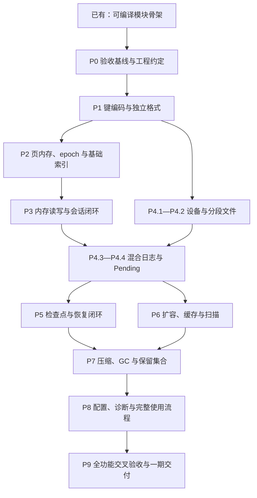

# RasterKV 第一期实现计划地图

更新日期：2026-09-10。状态：**P0、P1 已完成；存储引擎仍未实现。**

本文是后续实施的统一入口和任务状态台账。范围依据 [05 第一阶段范围](05-RasterKV第一阶段与支持库选型.md)，接口依据 [09 模块设计](09-RasterKV模块设计.md)、[10 公开接口](10-RasterKV公开接口.md)、[11 状态协议](11-RasterKV内存与状态协议.md)，现有文件入口见 [13 模块骨架](13-模块基础骨架.md)。实施中按本文任务编号推进，以运行行为和验收证据判断完成。

## 1. 第一期交付目标

交付一个可以在 **Linux 和 macOS 使用基础本地文件后端**运行的 Rust 嵌入式存储库 `raster`，核心对象为 `RasterKV<S>`。完整覆盖上游 C++ `FasterKv` 的单 store 功能与行为：并发读写、混合日志、Pending 推进、会话恢复、三类检查点、在线扩容、读缓存、物理扫描、两种单 store 压缩、自动压缩和安全回收。

已确定的范围约束：

- 使用独立持久化格式，不读取 C++ 日志或检查点文件；比较业务结果、状态和恢复进度。
- 共享 `RasterKV<S>`、线程绑定 `Session<S>`、拥有结果的 `Ticket<T>` 保持现有设计。核心不依赖外部异步运行时。
- 泛型键值、变长记录、普通值与原子值访问均在第一期。内存 CRUD 跑通只是中间里程碑。
- 用户已确认：第一期验收 Linux + macOS 基础后端；Windows 和 io_uring 后置。macOS 的成功不能代替 Linux 原生运行证据，反之亦然。
- F2、ColdIndex、跨 store 压缩、Azure 等远端设备、Future/actor 外观和 C++ 二进制兼容不进入本期。
- 没有预设吞吐量与 C++ 的固定比例，也没有虚构交付日期。正确性是硬门槛；性能基线与可接受回退标准在取得首轮数据后固定。

上游行为基线：`FASTER/cc`，提交 `321d872eabda6a0345c8bd76419f89723ed864ae`。参考 [03 功能与 API 契约](03-功能与API契约.md)；已发现的上游缺陷不作为必须复制的行为。

## 2. 当前起点与完成边界

| 项目 | 当前事实 | 计划中的处理 |
| --- | --- | --- |
| 工程骨架 | 18 个职责模块、44 个 Rust 源文件；零外部依赖 | 保留模块分工，逐条接入真实路径 |
| 已有基础行为 | 配置与 ValuePlan 校验、对齐缓冲、结果槽、共享 Schema 组合，以及 P1.1 身份、地址、内建键与稳定哈希 | 复用；需要新行为时补充验证 |
| 构建验证 | P1.2 在 Rust 1.98.1 验证 39 个运行测试、5 个 compile_fail doctest，Linux/macOS 各三种特性组合通过 | 这是类型、键与测试基础证据，不是存储行为证据 |
| 引擎能力 | create/recover、CRUD、设备、日志、索引等仍有显式未实现返回 | P1.2 格式层已验收，P1.3 已验收，P2.1 已验收，P2.2 进行中 |
| 版本记录 | P0 起点为 `4f07dea7a5741c6a4f57df25a13599526dbe4466`；骨架、设计与 CI 均已提交 | P0 以该提交和后续实现提交建立证据链 |
| 原生平台验收 | 已有两平台骨架 CI；仍没有存储运行证据 | P0 建立环境记录，P4 开始双平台真实 I/O 验收 |

P0 已交付功能表、Rust 1.98.1 固定工具链和测试支持，双平台六组合通过；证据见 [P0 验收报告](acceptance/P0验收报告.md)。没有实现存储算法。以后“完成”必须附带对应提交或可重现补丁、测试及运行记录。

## 3. 总体地图



推荐执行顺序为 P0 → P1 → P2 → P3 → P4 → P5 → P6 → P7 → P8 → P9。图中的分支表示技术上可独立推进，不代表必须启用并行开发：P4.1/P4.2 可以提前完成，P5/P6 可以在 P4 后分别推进。P7 必须同时取得恢复保留协议和扫描/缓存/扩容的证据。

每个里程碑只要求其已声明能力可用；尚未实现的入口继续明确拒绝。例如 P3 可以返回具备内存读写能力的实例，恢复入口仍拒绝，不能为等待所有模块完成而阻止首个运行闭环。

| 里程碑 | 完成后能运行的场景 | 通过门槛 |
| --- | --- | --- |
| P0 | 可重复运行现有工程检查，找到每项上游行为的验收条目 | 范围、环境和接口差异有记录 |
| P1 | 对键、记录、元数据作确定编码和损坏输入解析 | 固定字节样例与边界校验通过 |
| P2 | 安全分配/访问/回收记录，发布和查找日志地址 | 生命周期、竞争、代次模型通过 |
| P3 | 多会话在内存中执行四种操作并正确关闭 | 与参考模型一致，普通值/原子值/变长值均覆盖 |
| P4 | 数据量超过内存，磁盘读写和 Pending 可正确完成 | Linux/macOS 文件后端及故障、排空测试通过 |
| P5 | 并发写入中检查点，重启恢复，再继续原会话 | 三种检查点、版本切分、崩溃注入通过 |
| P6 | 磁盘读缓存、在线扩容、物理扫描同时服务读写 | 竞争与持久化交叉场景通过 |
| P7 | 压缩搬迁、移动 begin、回收段、自动维护 | 活数据不丢、墓碑不复活、保留恢复集仍可恢复 |
| P8 | 用配置创建存储，观察真实状态，跑完整示例 | 第一阶段公开功能全部接通 |
| P9 | 在正式平台重复完成全部业务、故障与恢复流程 | 第 8 节所有交付门槛通过 |

## 4. 任务台账与具体交付

状态只能使用：**未开始、进行中、待验收、完成、阻塞**。以下表格是任务状态的唯一维护位置；里程碑完成由其任务和门槛共同推导。依赖写里程碑编号时，表示该里程碑全部任务已验收。

### P0：固定执行与验收基线

| 编号 / 状态 | 依赖 | 交付与主要文件 | 验收条件 |
| --- | --- | --- | --- |
| P0.1 / 完成 | 已有骨架 | 建立 `docs/acceptance/功能对应表.md`，逐项列 C++ 入口、Rust 入口、语义差异、测试名和本计划任务；记录骨架工作树基线 | 05 的每项功能均有负责人任务；公开选项、错误和输出没有漏项；区分骨架通过和引擎未实现 |
| P0.2 / 完成 | P0.1 | 建立 Linux/macOS 检查流程及 `docs/acceptance/环境与命令.md`；固定首期工具链、target、文件系统和依赖引入规则 | 当前骨架在两平台的默认/功能组合下运行；声明的 MSRV 有实际检查；无法取得的原生环境明确列阻塞 |
| P0.3 / 完成 | P0.1 | 在 `tests/support/` 建立确定种子操作轨迹、顺序参考模型、故障事件命名；固定接收/拒绝、回调副作用、序号和 panic 策略 | 先验证参考模型和轨迹格式本身；后续实现可以复用同一输入，不能把未接入的引擎测试标成通过 |

P0 只固定启动实现必需的契约。哈希、格式和内存许可的具体决定留到各自任务；新增依赖时核查当时版本、许可证、工具链兼容与实际依赖闭包，不直接照抄调研中的版本。

### P1：基础类型、键语义与独立格式

| 编号 / 状态 | 依赖 | 交付与主要文件 | 验收条件 |
| --- | --- | --- | --- |
| P1.1 / 完成 | P0 | `types/`、`schema/key.rs`、`schema/builtin.rs`：ID 生成、地址有效性、ByteKey/U64Key、编码相等和稳定哈希描述 | 空键、变长键、相同 tag 不同键、整数边界、算法/种子/编码版本变化均有明确结果；跨重启字节与哈希一致；[验收证据](acceptance/P1.1验收报告.md) |
| P1.2 / 完成 | P1.1 | `format/` 与 `docs/acceptance/磁盘格式规范.md`：记录头、页填充、材料清单、manifest、提交标识与恢复匹配规则 | 固定位宽/端序/长度上限/校验覆盖范围明确；固定样例可解码；截断、溢出、未知必需版本、损坏输入被拒绝；不保存 Rust 对象镜像 |
| P1.3 / 完成 | P1.2 | `schema/value.rs`：值编码适配契约、live/encoded 容量与对齐规则；为普通值和 AtomicU64Value 定义稳定编码 | 两种尺寸都不越槽；解码失败可清理；原子值落盘是逻辑数值；此任务不提前制造没有真实页保护的访问许可 |

格式先形成 v1 实施规范及样例；正式冻结在 P5 验证恢复协议后完成。冻结前每次不兼容修改同步样例和版本处理，不承诺开发期文件自动兼容。

### P2：真实内存所有权与基础索引

| 编号 / 状态 | 依赖 | 交付与主要文件 | 验收条件 |
| --- | --- | --- | --- |
| P2.1 / 完成 | P1 | `epoch/`、`sync/`：参与者注册/注销、guard、代次、延迟回收；接入小规模并发模型 | 最慢读者退出前不回收；旧槽代次无效；遗忘 guard 至多阻碍回收，不造成悬垂引用；模型使用统一可控同步原语 |
| P2.2 / 待验收 | P2.1 | `log/`、`schema/value.rs`、`schema/builtin.rs`：页池、记录预留/发布/放弃、租约、MutationGate 和内建 ValueLayout | 未初始化记录不可见；失败初始化只清理已初始化部分；许可不能逃逸；原地更新与替换互斥规则成立；Miri 检查可独立运行的内存路径 |
| P2.3 / 未开始 | P2.1、P1.1 | `index/`：桶/tag、溢出桶、链头快照、基础 CAS 发布和冲突重查 | 碰撞不串键；发布前记录已初始化；失败 CAS 不泄漏可见半记录；索引只持地址，测试通过真实索引接口 |

P2 暂不需要完整刷盘或在线扩容，但索引快照必须已有表代次、页访问必须已有真实代次检查。不能先用无保护指针跑通再把内存安全留到末期。

### P3：第一个可用的内存 RasterKV

| 编号 / 状态 | 依赖 | 交付与主要文件 | 验收条件 |
| --- | --- | --- | --- |
| P3.1 / 未开始 | P2 | `api/store.rs`、`api/session.rs`、`engine/mod.rs`、`coordination/`：create、clone、会话身份/序号、注册/注销、基础关闭与 shutdown | 已就绪才返回实例；拒绝不消费序号；重复会话处理确定；shutdown 立即报告活跃会话，不等待同线程自己的 Session |
| P3.2 / 未开始 | P3.1 | `engine/read.rs`、`upsert.rs`、`rmw.rs`、`delete.rs`：同步四操作、墓碑选项、条件创建、原地更新和追加回退 | 与顺序模型一致；值增长触发追加；同键多线程 RMW 不丢更新；替换路径与原地修改共同仲裁，不能只依赖索引 CAS |
| P3.3 / 未开始 | P3.2 | 请求接受/终结路径、用户函数错误策略；新增可执行内存示例和并发历史测试 | 普通值与原子值都可用；错误/恐慌后的 NotApplied/Applied/Unknown 符合契约；可能已修改的请求不盲重试；!Send 用户上下文仍在原线程 |

此里程碑使用受限内存容量场景。内存不足必须明确处理，不能丢弃仍可见数据或伪造磁盘能力；完整页循环与挂起在 P4 验收。P3 建立首轮吞吐/延迟记录，后续阶段复用相同基准输入。

### P4：文件设备、混合日志与 Pending

| 编号 / 状态 | 依赖 | 交付与主要文件 | 验收条件 |
| --- | --- | --- | --- |
| P4.1 / 未开始 | P1 | `device/memory.rs`、`null.rs`、`mod.rs`：可控内存设备、空设备、请求/缓冲归还和故障注入 | 拒绝归还原请求；接受后恰好一次完成；覆盖短读短写、错误、乱序、取消竞争、关闭；Null 明确不提供磁盘恢复保证 |
| P4.2 / 未开始 | P4.1 | `device/thread_pool.rs`、`storage/`：Linux/macOS 工作线程文件后端、偏移 I/O、段映射、同步、原子发布和路径约束 | 两平台真实临时目录读写/重开通过；所有错误归还缓冲；文件/目录同步能力明确；路径不能越出根；段代次防止旧 I/O 污染新文件 |
| P4.3 / 未开始 | P3、P4.2 | `log/`、`engine/pending.rs`、`engine/progress.rs`：循环页、各地址边界、刷盘、淘汰、磁盘链追踪、变长补读与完成路由 | 数据量超过内存至少多次页窗口循环；四操作最终结果与内存相同；异步等待前释放许可；迟到 I/O 校验请求/页/文件代次；刷盘中无撕裂记录 |
| P4.4 / 未开始 | P4.3 | `api/session.rs`、`api/completion.rs`：poll/wait/drain、预算、背压、超时、在途关闭及失败退出 | Ticket 丢弃不取消业务；Session 关闭后仍能取已完成结果；重复/错会话完成不误投；超时保留推进能力；设备队列与结果槽不无限增长 |

工作线程只处理拥有型缓冲和设备请求，不执行用户的 Read/RMW 上下文。普通 I/O 完成不表示检查点持久化。P4 的 durable sync 能力为 P5 提供基础，不提前报告会话 durable progress。

### P5：检查点、恢复与会话持续性

| 编号 / 状态 | 依赖 | 交付与主要文件 | 验收条件 |
| --- | --- | --- | --- |
| P5.1 / 未开始 | P4 | `coordination/`、`engine/progress.rs`：全局动作仲裁、阶段参与集合、当前/前一上下文与会话切分 | 注册/退出与阶段开始无遗漏；旧请求不偷偷换版本；不活跃会话/失败会话的处理可解释；维护等待同时允许请求推进 |
| P5.2 / 未开始 | P5.1 | `checkpoint/`、`format/`、`storage/`、`log/`：完整/索引/日志检查点、冻结页、写材料与提交发布 | 先排空和冻结所需旧状态，再同步材料/manifest，最后发布并同步目录；中间失败不得返回成功；仅索引检查点不生成会话持久化承诺 |
| P5.3 / 未开始 | P5.2 | `checkpoint/`、`api/store.rs`：恢复集合匹配、校验、模糊索引重放、版本过滤、continue_session | 重启后的键值/墓碑/版本及每会话持久化切分一致；不兼容 token/缺材料/损坏被拒绝；恢复完成前不发布 store；可继续写入并再检查点 |
| P5.4 / 未开始 | P5.3 | 故障设备与子进程崩溃测试；恢复集合保留记录；冻结 v1 格式及兼容拒绝行为 | 每个提交阶段中断后只接受完整提交；后续原地写不能破坏旧检查点；保留两代恢复集合可分别恢复；序号空洞/在途请求不导致虚假 durable prefix |

关键顺序：固定恢复点所需范围 → 冻结对应记录/页并使后续修改追加 → 写并同步全部材料 → 写并同步 manifest → 发布提交标识并同步目录 → 报告成功。普通页 flush 不能替代该协议。

首次恢复可以先验证无缓存、无扩容、无压缩配置；这不免除 P6/P7 接入后重新验证相关交叉场景。v1 格式一旦冻结，后续改变必须显式升级或证明兼容。

### P6：在线扩容、读缓存与物理扫描

| 编号 / 状态 | 依赖 | 交付与主要文件 | 验收条件 |
| --- | --- | --- | --- |
| P6.1 / 未开始 | P4 | `index/`、`coordination/`：增量扩容、表代次、协作推进、旧表回收与完成报告 | 并发读写和 Pending 穿越扩容仍正确；旧请求重定位；旧表受 epoch 保护；重复发起/动作冲突明确；新容量报告真实 |
| P6.2 / 未开始 | P4 | `cache/`、`engine/read.rs` 及写路径：插入校验、命中、失效、淘汰、主日志地址规范化 | 缓存插入与写入/删除交错不返回旧值；淘汰不悬垂；持久材料不包含缓存地址；恢复从空缓存开始 |
| P6.3 / 未开始 | P4 | `scan/`、`api/scan.rs`：物理记录扫描、无/单/双页缓冲、范围校验与短租约 | 变长、页末填充、invalid、墓碑和旧记录按约定输出；输出拥有数据；截断竞争明确报错；扫描不假装去重快照 |
| P6.4 / 未开始 | P6.1、P6.2、P6.3、P5 | 读写/扩容/缓存/扫描与检查点的集成测试 | 全局动作按仲裁协议接受或拒绝；检查点恢复后索引可用、缓存为空；扫描不永久阻止页回收；缓存开关不改变最终结果 |

### P7：压缩、逻辑截断与安全物理回收

| 编号 / 状态 | 依赖 | 交付与主要文件 | 验收条件 |
| --- | --- | --- | --- |
| P7.1 / 未开始 | P5、P6 | `engine/conditional_copy.rs`、`maintenance/`：源记录校验、复制发布、扫描去重式和查索引式单 store 压缩 | 压缩与原地 RMW/追加/删除竞争不覆盖新值；过时源不可重发布；源许可不跨 I/O；普通 Compact 不暗中移动 begin |
| P7.2 / 未开始 | P7.1 | `maintenance/`、`storage/`、`checkpoint/`：ShiftBeginAddress、索引 GC、段删除、保留集合约束及释放流程 | 逻辑 begin 与物理删除分别报告；保留恢复集所需段不删；DeferredByRecoverySet 结束本次动作，后续可检查点并再回收；删除失败可安全重试 |
| P7.3 / 未开始 | P7.2 | 自动压缩调度、多工作线程、可选 shift/checkpoint 后续动作、等待和停止 | 后台维护与手动维护复用同一协议；关闭可排空；墓碑不复活；多次压缩、检查点、回收、重启后数据和会话进度仍一致 |

保留集合的释放必须有显式策略/入口，不能在磁盘压力下静默删除用户仍保留的恢复点。单 store 两种压缩策略都在本期；无需为了旧 Compact 的实现方式引入 F2 或 ColdIndex。

### P8：完整公开功能与使用流程

| 编号 / 状态 | 依赖 | 交付与主要文件 | 验收条件 |
| --- | --- | --- | --- |
| P8.1 / 未开始 | P7 | `config/`、`diagnostics/`：完整配置映射、TOML 文件/字符串、预分配、统计开关及状态输出 | 默认值和差异有文档；非法选项明确拒绝；日志跨度不冒充有效键数；会话数、缓存量、压缩状态来自真实引擎；不安装全局日志订阅器 |
| P8.2 / 未开始 | P8.1 | `examples/` 与公开 rustdoc：内存、超内存磁盘、变长/原子值、恢复续跑、压缩和诊断示例 | 示例实际运行；不依赖测试内部构造；只使用公开接口完成整个生命周期；错误/超时处理完整；功能表每行都映射到已实现入口 |

配置与必要诊断可在前面任务中按需接入；P8 负责补全及核对，不要求把故障诊断留到末期才开始。

### P9：第一期总验收

| 编号 / 状态 | 依赖 | 交付与主要文件 | 验收条件 |
| --- | --- | --- | --- |
| P9.1 / 未开始 | P8 | Linux 上构建上游行为对照程序；完成随机轨迹、并发历史与故障交叉矩阵，输出 `docs/acceptance/一期验收报告.md` | 必需功能无空项；参考模型、协议不变量和上游兼容场景分别有证据；已知上游缺陷明确归档，不能作为任意差异的借口 |
| P9.2 / 未开始 | P9.1 | 两平台正式检查、基准报告、资源长期循环、依赖/unsafe/占位入口审查 | 达到第 8 节门槛；记录硬件/系统/文件系统/工具链/特性；第一期运行入口没有未实现返回；后置后端不宣称已支持 |
| P9.3 / 未开始 | P9.2 | 更新 README、05/09/10/11/13 及功能对应表，形成第一期完成快照与后续 TODO | 文档、代码和证据一致；已知限制明确；可从记录版本复现实例与检查；本任务不包含自动发布 crates.io |

## 5. 模块归属地图

这里的归属用于找到实现任务，不要求把一个模块一次写完。运行闭环需要跨模块接入，但各模块仍封装自己的状态和错误处理。

| 模块 | 首次可用 | 本期完整验收 | 核心责任 |
| --- | --- | --- | --- |
| types | P1.1 | P5/P8 | 身份、地址、错误影响、业务与持久化进度 |
| config | 已有部分 | P8.1 | 参数对象、解析和实际后端能力校验 |
| schema | P1/P2.2 | P3/P5 | 键语义、值容量、受保护访问和稳定编码 |
| sync | P2.1 | P9.2 | 原语与模型测试接入 |
| epoch | P2.1 | P6/P7 | 访问寿命及旧页/旧表延迟回收 |
| log | P2.2 | P4/P5/P7 | 分配、页窗口、安全边界与冻结 |
| index | P2.3 | P5/P6/P7 | 查找发布、扩容、恢复和 GC |
| api | P3.1 | P8.2 | 可用对象、线程会话、操作结果和维护报告 |
| engine | P3.2 | P4/P5/P7 | 操作执行、Pending 续跑和条件复制 |
| coordination | P3.1 | P5/P6/P7 | 全局动作、会话切分和关闭协调 |
| device | P4.1 | P4.2/P9.2 | 内存/空/本地设备及请求资源终结 |
| storage | P4.2 | P5/P7 | 分段文件、提交命名与安全删除 |
| format | P1.2 | P5.4 | 显式编码、校验和兼容规则 |
| checkpoint | P5.2 | P5.4/P6.4/P7 | 持久化切分、提交发布、恢复和保留集合 |
| cache | P6.2 | P6.4/P7 | 缓存一致性与主日志地址规范化 |
| scan | P6.3 | P6.4/P7 | 有界物理遍历及数据所有权 |
| maintenance | P7.1 | P7.3 | 压缩、逻辑/物理回收及自动调度 |
| diagnostics | 按需接入 | P8.1 | 真实状态、资源量和统计输出 |

## 6. 测试地图与证据要求

测试随对应任务实现，不在最后集中补写。通过公开接口的场景测试验证用户可观察行为；内部 epoch、MutationGate、发布和恢复阶段通过小模型验证关键交错，不复制实现结构来制造覆盖率。

| 测试族 | 首次建立 / 补全 | 必须覆盖的输入与结果 |
| --- | --- | --- |
| 格式与键值属性 | P1 / P5 | 固定字节、随机合法记录、截断/错误长度、编码版本、live/encoded 容量 |
| 所有权与安全 | P2 / P4 | 未初始化内存、失败释放、页/表代次、许可寿命、!Send 上下文、Ticket 生命周期 |
| 单键业务 | P3 / P4 | 缺失/存在/墓碑；四操作选项；普通/原子/变长值；内存/磁盘路径 |
| 并发一致性 | P3 / P7 | 同键竞争、hash/tag 碰撞、原地更新对替换、缓存插入对删除、压缩对 RMW |
| I/O 与进度 | P4 / P7 | 拒绝/短传输/乱序/失败/取消；队列满；页预算耗尽；超时/关闭/迟到完成 |
| 崩溃与恢复 | P5 / P7 | 每个提交步骤故障、两代恢复集、版本不匹配、已提交页后续修改、GC 后恢复 |
| 全功能交错 | P6 / P9 | Pending 与检查点/扩容/缓存/扫描/压缩；动作冲突按协议拒绝且仍可继续 |
| 平台与资源 | P4 / P9 | Linux/macOS 原生文件后端；重复启动关闭、页循环、扩容、压缩和恢复；内存/句柄/队列量受控 |
| 性能 | P3 / P4 / P9 | 固定与变长值、均匀与热点、多线程、纯内存和超内存；吞吐、P50/P95/P99、I/O 放大、内存及恢复耗时 |

参考标准分三层：

1. 确定操作序列对照顺序键值模型，覆盖最后可见值和操作选项；并发轨迹用小规模历史检查与协议模型，不能用运行结束时的最终值替代完整并发正确性。
2. 恢复对照所选检查点的会话切分和可恢复状态，不能对照崩溃前最后一次成功返回；会话序号有空洞时，不能简单取最大完成序号。
3. 在 Linux 运行上游相同业务轨迹，比较可观察语义。Pending 出现的时机、内部重试次数和文件字节无需一致；上游崩溃或已确认缺陷需单独说明并按 Rust 契约验收。

故障注入的“掉电”模型必须区分未同步写入和已同步数据，以及命名空间持久化。子进程强杀验证进程崩溃；它本身不能证明真实断电安全。验收报告说明文件系统和同步保证的适用范围，不能用一次成功重启声称所有硬件故障已覆盖。

拟采用的证据目录为 `docs/acceptance/`；P0 已创建基础验收文件，具体执行结果见 [P0 验收报告](acceptance/P0验收报告.md)，后续文件由所属任务创建。大型测试日志保留在测试产物中，文档记录位置、种子、命令、版本和关键结果。

## 7. 高风险工作与停止条件

| 风险 | 首次解决任务 | 不满足时不得继续的行为 |
| --- | --- | --- |
| 普通值访问或原子/非原子混用导致数据竞争 | P2.2 | 不接入无保护值引用；先证明布局与许可协议 |
| 原地更新不改变索引地址，导致替换覆盖新值 | P3.2 | 不仅靠 CAS 重试；实现共同写入仲裁再接受并发 RMW |
| I/O 完成丢失/重复导致悬挂或重用内存 | P4.1/P4.4 | 不把请求当作已完成；先修复终结与缓冲归还 |
| 关闭与协作阶段相互等待 | P4.4/P5.1 | 不增加无限 wait 掩盖问题；明确推进者和失败退出 |
| 已提交文件后来被原地更新覆盖 | P5.2/P5.4 | 不报告 durable progress；证明冻结及追加策略 |
| 缓存地址落盘、旧缓存覆盖新写 | P6.2/P6.4 | 不通过开启缓存的恢复验收 |
| 压缩搬迁与删除/RMW 竞争丢数据 | P7.1 | 不移动 begin，也不物理删除旧段 |
| GC 删除保留恢复集所需材料 | P7.2 | 延后物理删除并终结当前动作，保留可继续维护能力 |
| 仅在 macOS 编译却声称跨平台 | P4.2/P9.2 | 对应平台任务保持待验收或阻塞，不能标一期完成 |

发现接口不足时，在对应任务内同步 09/10/11 和代码，不用持续加公开开关规避内部协议。只有影响已确认范围或改变用户可观察保证的决定才需要重新与用户讨论；普通内部实现选择按现有约束推进。

## 8. 第一期完成标准

以下条件必须同时成立：

- P0—P9 的任务与门槛全部完成，功能对应表覆盖 05 的全部第一期功能；所有必需入口真实运行，无未实现桩或默认成功替身。
- Linux 与 macOS 基础文件后端有原生构建、业务、故障和恢复记录；默认配置及 TOML 等本期特性通过相应组合。io_uring/Windows 明确为后置，不以本机 all-features 代替原生支持证明。
- 三类检查点和有效的索引/日志配对能恢复；会话续跑正确；缓存、扩容、压缩、GC 后仍满足恢复契约；损坏或不兼容文件明确拒绝。
- 接收后的请求恰好终结一次；拒绝不消费请求；普通结果与持久化结果分离；背压、超时、panic/错误及关闭有可解释状态。
- 关键并发协议有模型或定向交错证据；unsafe 访问有不变量与适用测试；范围内模块的临时 dead_code 抑制清理，保留项逐项说明。
- 格式/Clippy/单元与集成测试/文档测试/rustdoc 全部通过；平台专用和故障检查使用额外记录的命令，不混入一句“cargo test 通过”。
- 基准与重复资源循环报告齐全。性能回退阈值在优化前记录，未达阈值须解释并处理，不能在结果出来后修改阈值规避问题；未要求第一期达到 C++ 固定百分比。
- 公开示例可从创建一直运行到检查点、恢复继续、维护和关闭；文档明确能力、格式版本、支持平台与后续 TODO。

常规检查基线：

```sh
cargo fmt --all -- --check
cargo clippy --all-targets --all-features -- -D warnings
cargo test --all-features
cargo doc --all-features --no-deps
```

Loom、Miri、故障注入、子进程重启、上游对照和性能命令在相应任务接入后写入环境与命令记录。没有实际执行的命令不计完成证据。

## 9. 后续如何按本计划推进

当前下一项：**P2.2，页内存、记录许可与值布局。** P0.1—P0.3、P1.1 已验收，见 [P0 验收报告](acceptance/P0验收报告.md) 与 [P1.1 验收报告](acceptance/P1.1验收报告.md)。P1.2 证据见 [验收报告](acceptance/P1.2验收报告.md)。后续可直接提出“按计划推进 P1.3”或“继续下一项”，沿依赖选择最早未完成且未阻塞的任务。

每次实施遵循以下流程：

1. 读取该任务、依赖证据与涉及模块；先核对工作区已有变更，不重做已完成工作。
2. 将任务置为进行中，落实交付与必要测试。表格过大时按原编号添加子任务，不随意重编号。
3. 接入真实调用路径，执行对应验收；未通过保持进行中或待验收，记录具体失败。仅外部条件阻止推进时标阻塞，并继续可独立完成的任务。
4. 验收通过后更新本表状态，在验收文档记录提交或补丁标识、命令/种子/结果、限制及下一项。涉及协议变化同时更新相关设计文档。
5. 里程碑结束运行其交叉场景，给出可运行示例；最终 P9 汇总第一期交付证据。

任务完成不以代码行数、文件数或“所有方法有函数体”计数。当前完成范围为骨架、P0 验收基础设施及 P1.1 类型与键语义；P1.2 格式层已验收，P1.3 已验收，P2.1 已验收，P2.2 进行中。

## 10. 第一期之外的 TODO

- Windows 原生后端与平台验收。
- Linux io_uring 后端、取消/关闭语义及与基础后端的性能比较。
- F2 热冷组合、ColdIndex、跨 store 条件插入与压缩、组合检查点。
- Azure/其他远端设备。
- 可选 Future/actor 外观及运行时适配。
- C++ 文件兼容工具、独立追加日志产品，以及未在上游 FasterKv 范围内的事务/复制能力，另立需求。

这些项目不能用于推迟本期读缓存、单 store 压缩、索引扩容或恢复功能，也不应为预留实现而污染本期核心接口。
