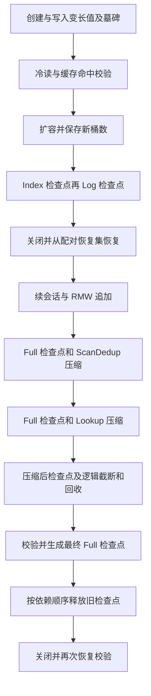

# RasterKV 公开接口使用流程

这些示例执行真实引擎流程，只依赖公开 API；它们不导入测试模块、不创建内部 Session 或维护成功报告。命令在仓库根目录运行，工具链为 Rust 1.98.1。完整配置与单位见 [配置与诊断](15-配置与诊断.md)，阶段证据见 [P8.2 交付记录](acceptance/P8.2公开流程交付记录.md)。

## 可运行入口

```sh
cargo run --locked --release --example memory
cargo run --locked --release --example memory_matrix
cargo run --locked --release --example interface
cargo run --locked --release --example disk_lifecycle
cargo run --locked --release --example automatic
```

`config-toml` 组合添加 `--no-default-features --features config-toml`，全部特性添加 `--all-features`。disk_lifecycle 在启用 TOML 时实际解析仓库的完整默认配置，再调整本例的小容量与预分配参数；其他组合使用 Config 对象。全部特性不代表 io_uring 可运行。

| 示例 | 实际执行与检查 | 设备与资源 |
| --- | --- | --- |
| memory | 原子计数器 10,000 次 RMW、读取、删除、关闭；输出吞吐及分位数 | Null，全部数据留在内存，不承诺磁盘或恢复 |
| memory_matrix | 原子整数与 32–512 字节普通值；均匀/热点、1/4 线程、每组 3 轮 | Null；只在未接受 Busy 时归还输入并有界重试，不重放已接受失败 |
| interface | 400 次写入后两个异构冷读 Pending；跳号接受、倒退拒绝归还、立即超时、关闭后收取结果、重复收取拒绝 | MemoryDevice，4×4096 字节日志；内存设备只作临时后端 |
| disk_lifecycle | 40 个键的两代变长值、空键/非 UTF-8、墓碑、RMW 追加；冷读/缓存、扩容、三种检查点、两次恢复、两种压缩、回收、释放与诊断 | Linux/macOS ThreadPool，16 KiB 日志、16 KiB 段、32 KiB 预分配缓存，2 个 I/O 工作者 |
| automatic | 800 次变长写入，与自动压缩交错；确认至少一次真实压缩完成，停止、校验 32 个最新值、显式检查点及关闭 | ThreadPool，16 KiB 日志、64 KiB 自动日志预算，2 个压缩工作者；预算不是拒写上限 |

memory_matrix 是可复现实例与已有基线入口，不凭单次结果宣称性能达标。P9.2 仍须完成正式基准与长期资源验收。

disk_lifecycle 不带参数时创建本次专属临时目录，流程及关闭全部成功后清理；失败时保留材料。可传入一个尚不存在、父目录已存在的数据目录：

```sh
cargo run --locked --release --example disk_lifecycle -- ./example-data
```

显式目录成功后保留，二次运行直接拒绝，不覆盖旧存储。它是完整演示入口，不是通用数据库管理命令或针对任意已有存储的恢复工具。示例内部保存并传递恢复集、扩容后桶数和会话身份；实际应用必须将这些恢复信息纳入自己的持久化配置。`scripts/check_examples.py` 使用新临时目录验证参数错误、已有内容保护、显式目录保留和二次运行内容不变。

## 磁盘流程



三种扫描缓冲模式读取同一物理范围。示例首轮实际有 86 条物理记录及 5 条墓碑；它们包含历史版本，不能解释为 86 个有效键。40 个键的当前结果由独立保存的拥有型预期值逐个比较。

Index 报告不含会话持久化进度；Log 绑定先前已提交的索引。恢复后以 `continue_session` 得到原身份和进度，后续序号递增。ScanDedup 不隐式 shift；Lookup 通过显式选项请求检查点与 shift。释放旧材料时先释放引用索引的 Log，再释放该 Index，保留最终恢复集。任何维护失败都会保留完整共享错误，包括已经复制、截断或释放的部分效果。

## 会话与票据

同一线程、同一 RasterKV 实例至多一个活跃 Session；克隆存储不建立新实例。不同线程可各自注册，同线程可操作不同存储。创建或续接准备失败会归还线程名额。成功 close 即归还名额，无需等待 Session 对象销毁；Drop 同样退出，但有在途请求或参与屏障时仍可能导致失败关闭。

恢复身份关闭后可以再次续接；`ResumedSession.progress` 是检查点进度，`session.last_accepted()` 还保留本实例上一次会话接受的更新序号。新序号必须超过后者，不能每次续接都退回检查点。P8.2 修补了早期入口未执行线程限制的问题；对应旧组件测试现用真实工作线程控制交错，非 Send 请求和票据不跨线程传递。

`Submission::Ready` 和 `Pending` 均表示已接受。外层 `Rejected` 归还输入且不消费序号；只有确定未接受的 Busy 可按原输入和同一序号重试。内部计算冲突由引擎协议处理，应用不能因为已接受操作失败而重新提交修改。

interface 示例的两个票据分别产出 u64 和 String，上下文持有本线程 Rc。已经过期的 Deadline 返回超时，票据仍 Pending；随后正常排空、close、销毁会话，再从票据收取拥有型结果。每个回调仅执行一次，第二次收取返回 AlreadyTaken。

## 错误与有界收尾

disk_lifecycle 的每次同步等待有 60 秒总预算，分成最多 5 秒的等待片段，始终使用原票据；automatic 对未接受 Busy 的重试也有截止时间。最终超时返回失败并进入收尾，不重放业务或重新发起已接受维护。普通内存示例使用固定有限工作量；memory_matrix 的 Busy 重试也受 60 秒边界限制。

OperationError 实现标准 Display/Error，格式化保留 NotApplied、Applied 或 Unknown，source 指向原始 cause。共享维护报告通过示例自己的错误包装保留原报告；流程和收尾均失败时输出两个错误，不用收尾错误覆盖最初原因。示例失败返回非零退出码。

会话和扫描先退出；随后停止自动维护，并在 Busy/超时边界内推进已接受的手动动作与设备关闭。推进错误被保留，即使资源最终排空也不将流程改报成功。shutdown 不自动创建检查点。Busy 后可用 `diagnostics().active_session_ids` 定位活跃会话；身份列表与 active_sessions 来自同一次注册表读取，其余组件仍不是事务快照。

## 功能对应入口

详细 C++ 来源、参数和错误保留在 [功能对应表](acceptance/功能对应表.md)。下表补齐实际调用与证据入口，A28 是尚待 P9 完成的总验收任务，不冒充已经通过。

| 编号 | 已实现入口 | 运行示例或测试位置 |
| --- | --- | --- |
| A01 | Builder::{config,device,create}、Config::from_toml_* | disk_lifecycle、config::tests、skeleton_boundary |
| A02 | Session::read、ReadOperation | interface、disk_lifecycle、p3_model |
| A03 | Session::upsert、UpsertOperation | memory_matrix、disk_lifecycle、p3_failures |
| A04 | Session::rmw、RmwOperation | memory、disk_lifecycle、p3_model、p3_failures |
| A05 | Session::delete、DeleteOperation | memory、disk_lifecycle、p3_model |
| A06 | KeyCodec、ValueLayout、内建 SchemaPair/布局 | memory_matrix、disk_lifecycle、p1_keys、p1_values |
| A07 | start_session、SessionOptions、线程名额租约 | p3_lifecycle、p3_history、真实线程 p3_model |
| A08 | continue_session、ResumedSession.progress | disk_lifecycle、p5_recovery 的关闭重续与序号测试 |
| A09 | Session::{close,Drop} | interface、p3_lifecycle、pending_read_tests |
| A10 | refresh、poll、wait、complete_pending、wait_maintenance | interface、disk_lifecycle、automatic |
| A11 | Submission、Rejected、Ticket::{id,try_take} | interface、p3_failures、compile_fail doctest |
| A12 | 内部 MemIndex，由 Builder 与四操作接通 | index 条件发布与冲突单元测试、p3_model 当前值核对 |
| A13 | Maintenance::grow_index | disk_lifecycle、growth_tests、online_tests |
| A14 | 混合日志与 log 配置 | disk_lifecycle 超内存读写、storage_progress、p3_model 原生轨迹 |
| A15 | Memory/Null/ThreadPool DeviceFactory 与 Device | 五个示例、p4_device、p4_files |
| A16 | Maintenance::checkpoint 三种模式 | disk_lifecycle、checkpoint_crash_tests |
| A17 | Builder::recover、RecoverySet | disk_lifecycle、p5_recovery、checkpoint_safety_tests |
| A18 | Maintenance::compact(ScanDedup) | disk_lifecycle、p7_compaction |
| A19 | Maintenance::compact(Lookup) | disk_lifecycle、automatic、conditional_copy_tests |
| A20 | Maintenance::shift_begin、GcReport | disk_lifecycle、gc_tests、p7_metadata |
| A21 | 自动配置、status、stop、两类 wait_auto_compaction | automatic、auto_compaction_tests |
| A22 | cache 配置、缓存实际读路径 | disk_lifecycle、cache_tests、p5_recovery |
| A23 | scan、RecordScanner::{next_record,close} | disk_lifecycle 三种模式、p6_scan |
| A24 | diagnostics、自动预算到达状态 | 三个新示例、p8_tests、p3_lifecycle 的活跃身份 |
| A25 | 统计开关、statistics、write_statistics | disk_lifecycle、p8_tests 的采样启停与失败边界 |
| A26 | shutdown、ShutdownReport、活跃身份诊断 | 所有示例、p3_lifecycle、pending_read_tests |
| A27 | release_checkpoint、CheckpointReleaseReport | disk_lifecycle、checkpoint_release_tests 与中断测试 |
| A28 | 模型、并发历史、故障和原生 CI 验证入口 | 已有 p3_model/p3_history 与分阶段故障测试；P9 上游对照和总验收尚未完成 |
